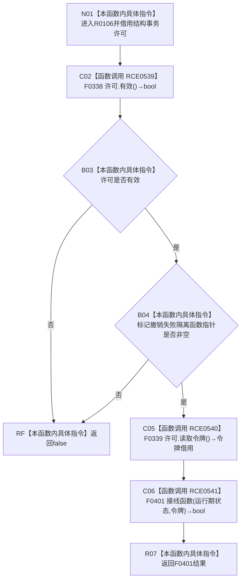

# CF-L10-0022 结构写入执行器标记撤销失败隔离现状流程图

图类型：现状流程图
代码版本：`7ad8cf5113162fe92b9f8d43f2b5b9f00d292d1a`
源码事实提交：`3920a74638264f9f539d50f32f3c9fe5fb1982ab`
源码 blob：`292e602cef1dd658ac2b507a3cc9ced7270a4a86`
覆盖文件：`海中鱼巣/核心/执行器.结构写入.ixx:366-369`
唯一根函数：R0106
完整签名：`bool 海中鱼巣::结构写入执行器::标记撤销失败隔离(const 海中鱼巣::结构事务许可& 许可) const noexcept`
参数：`许可` 为 const 非拥有借用
返回结果：许可有效、隔离接线存在且接线调用返回 true 时返回 true，否则返回 false
已登记调用方：R0107，经 RCE0542
直接项目函数：RCE0539→F0338、RCE0540→F0339、RCE0541→F0401
外部边界：无
未解析项目调用：0
逐行映射表：`流程图/代码流程图/L10/CF-L10-0022_结构写入执行器标记撤销失败隔离_逐行代码映射表.md`
结构读取与写入：本函数只读许可与接线；F0401/R0099 被调路径负责实际隔离标志写入
验证输出：366—369 行完整映射；1 条项目入边、3 条项目出边、0 个外部边界
不得作为施工许可：是

## 流程图

## 当前边界

- RCE0541 已按生产接线解析到 F0401；函数指针为空时由短路表达式阻止调用。
- 本函数不直接写隔离状态，实际写入沿 F0401→R0099 发生。
