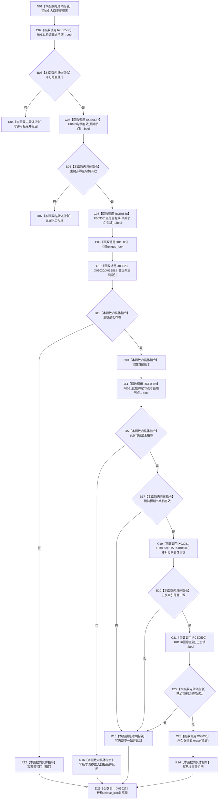

# CF-L10-0023 索引仓库严格删除主键现状流程图

图类型：现状流程图
代码版本：`3920a74638264f9f539d50f32f3c9fe5fb1982ab`
源码 blob：`8874312f67f19b220a08b1397c6103396878513d`
覆盖文件：`海中鱼巣/核心/索引仓库.cpp:357-400`
唯一根函数：R0125
完整签名：`海中鱼巣::结构写入结果 海中鱼巣::索引仓库::严格删除主键(std::uint64_t 主键, 海中鱼巣::节点句柄 预期节点, const 海中鱼巣::结构事务令牌& 令牌)`
参数：主键、预期节点按值；令牌为 const 非拥有借用
返回结果：许可拒绝、入口拒绝、幂等读回、版本漂移、内部不一致或已提交
已登记调用方：RCE0357、RCE0415
直接项目函数：RCE0586→R0121、RCE0587→F0163、RCE0588→F0630、RCE0589→F0051、RCE0590→R0126
外部边界：X01585、X01586、X01587、X01588、X01589、X03027、X03028、X03029、X03030、X03031、X03032、X03033、X03034、X03035、X03036
未解析项目调用：0
调用图：`流程图/主程序可达调用关系/01_main可达项目调用边表.md`
逐行映射表：`流程图/代码流程图/L10/CF-L10-0023_索引仓库严格删除主键_逐行代码映射表.md`
结构读取与写入：锁前验证令牌、句柄及节点当前有效性；锁内核对正反索引后删除正反绑定，并删除永久保留记录以支持撤销重绑
内部错误：预期节点已失效、正反索引不一致或已加锁删除失败
验证输出：357—400 行完整映射；2条入边、5条项目出边、15个外部边界
不得作为施工许可：是

当前边界：节点有效性在加锁前读取，锁内若对应正向记录仍存在但该事实为假则按内部不一致返回；所有锁内出口先析构锁。
