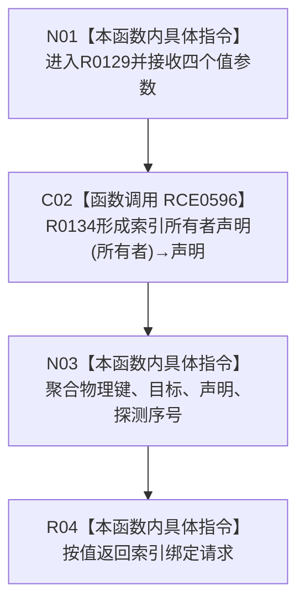

# CF-L10-0024 形成索引绑定请求现状流程图

图类型：现状流程图
代码版本：`3920a74638264f9f539d50f32f3c9fe5fb1982ab`
源码 blob：`ecdd8b7888aeda86fce1ba8bc02e40b5cfa282aa`
覆盖文件：`海中鱼巣/核心/索引所有权.数据.h:114-120`
唯一根函数：R0129
完整签名：`inline 海中鱼巣::索引绑定请求 海中鱼巣::形成索引绑定请求(std::uint64_t 最终物理键, 海中鱼巣::节点句柄 目标, 海中鱼巣::索引所有者 所有者, std::uint32_t 探测序号 = 0) noexcept`
参数：四项均按值传入；探测序号缺省为0
返回结果：由物理键、目标、标准所有者声明和探测序号聚合形成的请求值
已登记调用方：RCE1148、RCE1273、RCE1396、RCE1827、RCE1939、RCE1987、RCE2053
直接项目函数：RCE0596→R0134
外部边界：无；未解析项目调用：0
调用图：`流程图/主程序可达调用关系/01_main可达项目调用边表.md`
逐行映射表：`流程图/代码流程图/L10/CF-L10-0024_形成索引绑定请求_逐行代码映射表.md`
验证输出：114—120 行完整映射；不得作为施工许可：是

当前边界：本函数不验证请求完整性，也不写入索引仓库。
