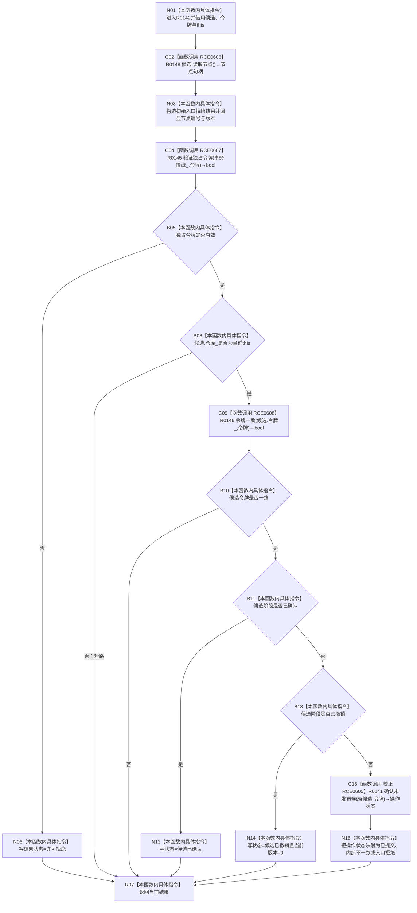

# CF-L10-0025 节点仓库结构化确认未发布候选现状流程图

图类型：现状流程图
代码版本：`010784a906e8283644a63a742151f6457a847c38`
源码事实提交：`3920a74638264f9f539d50f32f3c9fe5fb1982ab`
源码 blob：`f38b979a3f7cefd182a50e0b687c5a6fffebc91c`
覆盖文件：`海中鱼巣/核心/节点仓库.cpp:146-174`
唯一根函数：R0142
完整签名：`海中鱼巣::结构写入结果 海中鱼巣::节点仓库::结构化确认未发布候选(海中鱼巣::节点未发布候选& 候选, const 海中鱼巣::结构事务令牌& 令牌)`
参数：`候选` 为非拥有可写引用；`令牌` 为 const 非拥有借用；隐式 `this` 为可变节点仓库借用
返回结果：返回携带节点编号、预期版本和当前版本的结构写入结果；状态可能为许可拒绝、入口拒绝、候选已确认、候选已撤销、已提交或内部不一致
已登记调用方：R0060，经 RCE0407
直接项目函数：RCE0606→R0148、RCE0607→R0145、RCE0608→R0146、校正 RCE0605→R0141（调用点仅167）
外部边界：无
未解析项目调用：0
逐行映射表：`流程图/代码流程图/L10/CF-L10-0025_节点仓库结构化确认未发布候选_逐行代码映射表.md`
结构读取与写入：读取候选节点与阶段；仅在未发布阶段委托 R0141 写候选阶段，结果对象为局部值
验证输出：146—174 行完整映射；1 条项目入边、4 条项目出边、0 个外部边界
不得作为施工许可：是
不得宣称：状态 `已提交` 证明节点候选已经完成发布

## 流程图

## 当前边界

- RCE0605 只在第167行调用 R0141；旧登记中的第146行是本函数定义行，已从调用点口径移除。
- 候选已经确认或撤销时本函数不再次调用 R0141；撤销分支把当前版本显式归零。
- R0141 的 `已完成` 被映射为 `结构写入状态::已提交`，这里只表达当前代码枚举映射，不等于完成发布。
