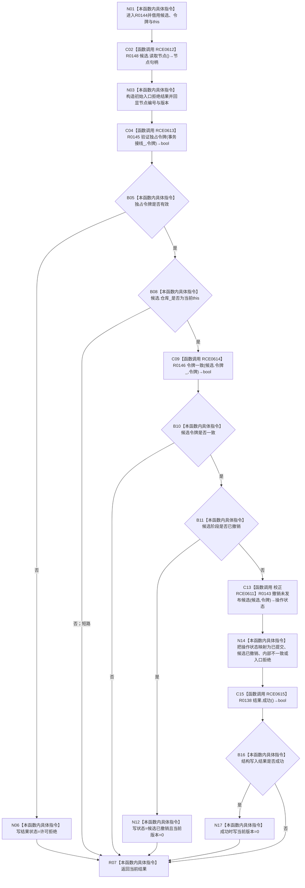

# CF-L10-0026 节点仓库结构化撤销未发布候选现状流程图

图类型：现状流程图
代码版本：`010784a906e8283644a63a742151f6457a847c38`
源码事实提交：`3920a74638264f9f539d50f32f3c9fe5fb1982ab`
源码 blob：`f38b979a3f7cefd182a50e0b687c5a6fffebc91c`
覆盖文件：`海中鱼巣/核心/节点仓库.cpp:204-231`
唯一根函数：R0144
完整签名：`海中鱼巣::结构写入结果 海中鱼巣::节点仓库::结构化撤销未发布候选(海中鱼巣::节点未发布候选& 候选, const 海中鱼巣::结构事务令牌& 令牌)`
参数：`候选` 为非拥有可写引用；`令牌` 为 const 非拥有借用；隐式 `this` 为可变节点仓库借用
返回结果：返回携带节点编号、预期版本和当前版本的结构写入结果；状态可能为许可拒绝、入口拒绝、候选已撤销、已提交或内部不一致
已登记调用方：R0062/R0022，经 RCE0417/RCE2425
直接项目函数：RCE0612→R0148、RCE0613→R0145、RCE0614→R0146、校正 RCE0611→R0143（调用点仅221）、RCE0615→R0138
外部边界：无
未解析项目调用：0
逐行映射表：`流程图/代码流程图/L10/CF-L10-0026_节点仓库结构化撤销未发布候选_逐行代码映射表.md`
结构读取与写入：读取候选节点与阶段；未撤销候选委托 R0143 擦除节点记录并写候选阶段
验证输出：204—231 行完整映射；2 条项目入边、5 条项目出边、0 个外部边界
不得作为施工许可：是
不得宣称：成功结果证明会话内其它候选也已撤销

## 流程图

## 当前边界

- RCE0611 只在第221行调用 R0143；旧登记中的第204行是本函数定义行，已从调用点口径移除。
- `幂等已撤销` 映射为 `候选已撤销`，且 RCE0615 判为成功后把当前版本归零。
- R0143 擦除节点记录后，本函数只完成值式状态映射，不追加其它仓库写入。
