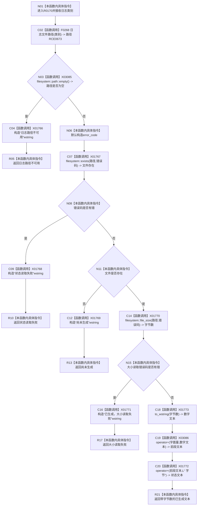

# CF-L10-0027 日志文件状态文本现状流程图

图类型：现状流程图
代码版本：`3920a74638264f9f539d50f32f3c9fe5fb1982ab`
源码 blob：`fe9dad1eb3728c823beccf305c783be96a3df33d`
覆盖文件：`海中鱼巣/界面/控制面板窗口.cpp:172-190`
唯一根函数：R0170
完整签名：`std::wstring 海中鱼巣::{匿名命名空间@控制面板窗口.cpp}::日志文件状态文本(日志类别 类别)`
参数：`类别` 按值传入
返回结果：返回路径不可用、读取失败、尚未生成、大小读取失败或带字节数的状态文本
已登记调用方：RCE0676（R0171，198）
直接项目函数：RCE0673 → F0268 `日志文件路径(类别)`
外部边界：X01766—X01773、X03085、X03086；未解析项目调用：0
调用图：`流程图/主程序可达调用关系/01_main可达项目调用边表.md`
逐行映射表：`流程图/代码流程图/L10/CF-L10-0027_日志文件状态文本_逐行代码映射表.md`
依据：关系发布基线 `010784a906e8283644a63a742151f6457a847c38`、当前三表与冻结源码
结构读写：只读文件系统状态，不写项目机器结构
不得作为施工许可：是
不得宣称：返回文本证明日志业务内容正确或日志能力完成

## 流程图

## 当前边界

- 173 行只保留项目边 RCE0673，不再保留重复的外部边界反查。
- `exists` 和 `file_size` 均使用非抛出错误码重载；错误转为人读状态文本。
