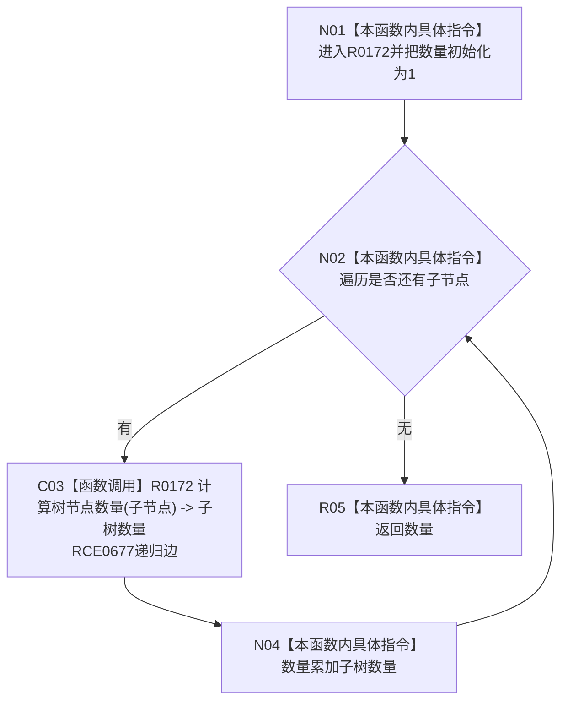

# CF-L10-0028 控制面板树节点数量现状流程图

图类型：现状流程图
代码版本：`3920a74638264f9f539d50f32f3c9fe5fb1982ab`
源码 blob：`fe9dad1eb3728c823beccf305c783be96a3df33d`
覆盖文件：`海中鱼巣/界面/控制面板窗口.cpp:202-208`
唯一根函数：R0172
完整签名：`std::uint64_t 海中鱼巣::{匿名命名空间@控制面板窗口.cpp}::计算树节点数量(const 海中鱼巣::控制面板树节点材料& 节点材料)`
参数：`节点材料` 为只读借用
返回结果：返回当前节点及全部递归后代的节点总数
已登记调用方：RCE0677（递归自调用）、RCE0678（R0173）
直接项目函数：RCE0677 → R0172（递归）
外部边界：无；未解析项目调用：0
逐行映射表：`流程图/代码流程图/L10/CF-L10-0028_控制面板树节点数量_逐行代码映射表.md`
依据：关系发布基线 `010784a906e8283644a63a742151f6457a847c38` 与冻结源码
结构读写：只读树节点材料，纯计数
不得作为施工许可：是
不得宣称：计数值证明树材料语义有效

## 流程图

## 当前边界

- 每个递归层先计入当前节点一次，再累计每个子树。
- 源码未设置递归深度限制或环检测，依赖输入材料形成有限树。
