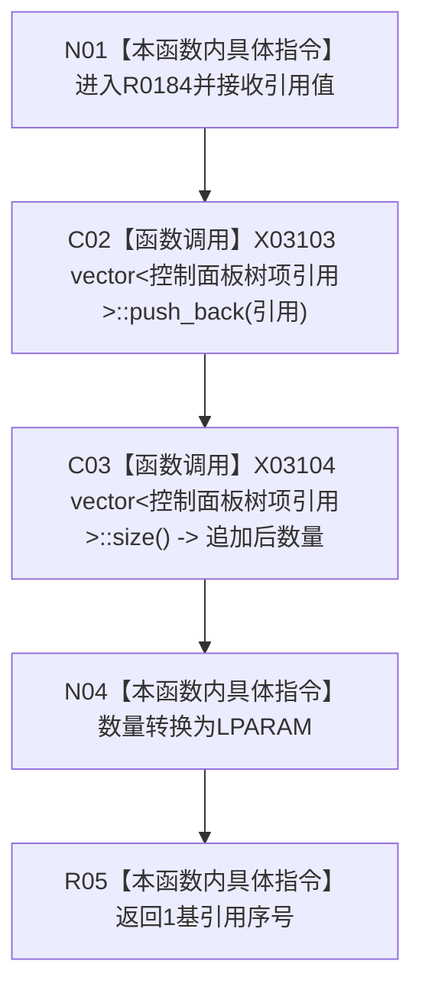

# CF-L10-0029 追加树项引用现状流程图

图类型：现状流程图
代码版本：`3920a74638264f9f539d50f32f3c9fe5fb1982ab`
源码 blob：`fe9dad1eb3728c823beccf305c783be96a3df33d`
覆盖文件：`海中鱼巣/界面/控制面板窗口.cpp:581-584`
唯一根函数：R0184
完整签名：`LPARAM 海中鱼巣::控制面板窗口::窗口实现::追加树项引用(海中鱼巣::控制面板树项引用 引用)`
参数：`引用` 按值传入，内部保存其中的节点材料借用指针
返回结果：返回追加后容器大小转换成的 1 基引用序号
已登记调用方：RCE0695、RCE0699
直接项目函数：无；外部边界：X03103、X03104；未解析项目调用：0
逐行映射表：`流程图/代码流程图/L10/CF-L10-0029_追加树项引用_逐行代码映射表.md`
依据：关系发布基线 `010784a906e8283644a63a742151f6457a847c38` 与冻结源码
结构读写：向窗口树项引用组追加一项
不得作为施工许可：是
不得宣称：取得引用序号证明 Windows 树项已经插入

## 流程图

## 当前边界

- 582 行 `push_back` 与 583 行 `size` 已分别绑定 X03103、X03104。
- 返回值零保留为无效序号；首次追加返回一。
