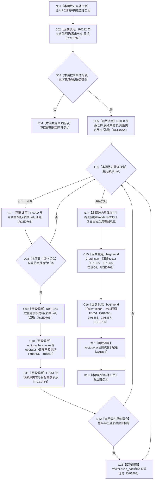

# CF-L10-0030 读取需求承接任务组现状流程图

图类型：现状流程图
代码版本：`3920a74638264f9f539d50f32f3c9fe5fb1982ab`
源码 blob：`24161aaaf7138004380b42b37882149e7ff3a087`
覆盖文件：`海中鱼巣/领域/任务服务.h:480-505`
唯一根函数：R0214
完整签名：`std::vector<海中鱼巣::节点句柄> 海中鱼巣::任务服务::读取需求承接任务组(海中鱼巣::节点句柄 需求节点, const 海中鱼巣::状态服务& 状态) const`
参数：需求节点按值传入；状态服务以 const 引用借用
返回结果：返回类型匹配、承接材料完整且来源需求相等的去重有序任务句柄组
已登记调用方：RCE0907（R0283）、RCE0935（R0286）
直接项目函数：R0222（RCE0763）、R0088（RCE0764）、R0213（RCE0765）、F0051（RCE0766）、R0215（RCE0767 回调）
外部边界：X01861、X01862、X01863、X01864、X01865、X01866、X01867、X01868；未解析项目调用：0
调用图：`流程图/主程序可达调用关系/01_main可达项目调用边表.md`
逐行映射表：`流程图/代码流程图/L10/CF-L10-0030_读取需求承接任务组_逐行代码映射表.md`
被调函数流程图：R0215 对应 `流程图/代码流程图/L11/CF-L11-0044_读取需求承接任务组排序lambda_现状流程图.md`
偏差清单：无
依据：RCE0907、RCE0935、RCE0763—RCE0767、X01861—X01868 与当前源码
结构读取与写入：只读关系、节点和承接材料；只修改局部返回向量
逻辑内返回：需求类型不匹配返回空向量；不合格来源节点被跳过
不得作为施工许可：是
不得宣称：返回任务组证明其中任务可执行或已完成

## 流程图

## 当前边界

- lambda R0215 的字段比较正文不归入本函数节点。
- 排序顺序依次为仓库编号、节点编号、版本号；随后按完整节点句柄相等去重。
