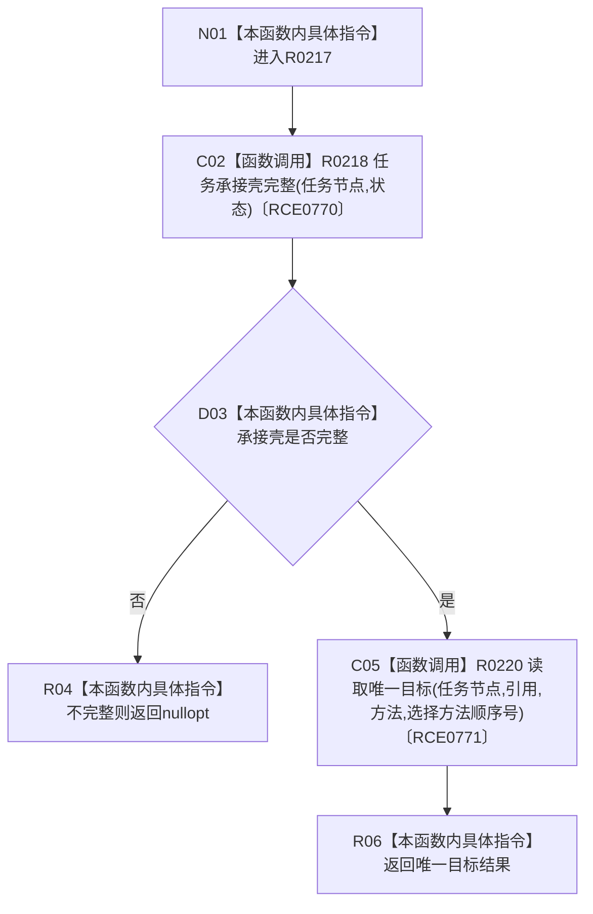

# CF-L10-0031 读取任务选择方法现状流程图

图类型：现状流程图
代码版本：`3920a74638264f9f539d50f32f3c9fe5fb1982ab`
源码 blob：`24161aaaf7138004380b42b37882149e7ff3a087`
覆盖文件：`海中鱼巣/领域/任务服务.h:543-548`
唯一根函数：R0217
完整签名：`std::optional<海中鱼巣::节点句柄> 海中鱼巣::任务服务::读取任务选择方法(海中鱼巣::节点句柄 任务节点, const 海中鱼巣::状态服务& 状态) const`
参数：任务节点按值传入；状态服务以 const 引用借用
返回结果：承接壳不完整返回 `nullopt`；否则返回指定顺序号的唯一方法目标
已登记调用方：RCE0910（R0284）、RCE0951（R0288）
直接项目函数：R0218（RCE0770）、R0220（RCE0771）
外部边界：无；未解析项目调用：0
调用图：`流程图/主程序可达调用关系/01_main可达项目调用边表.md`
逐行映射表：`流程图/代码流程图/L10/CF-L10-0031_读取任务选择方法_逐行代码映射表.md`
偏差清单：无
依据：RCE0910、RCE0951、RCE0770、RCE0771 与当前源码
结构读取与写入：只读任务关系；不执行方法
逻辑内返回：承接壳不完整时返回空 optional
不得作为施工许可：是
不得宣称：返回方法节点证明方法已执行或适合当前任务

## 流程图

## 当前边界

- 本函数仅查询选择结果，不执行方法。
