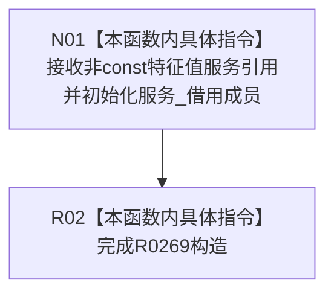

# CF-L10-0032 特征值原始材料事务参与者构造现状流程图

图类型：现状流程图
代码版本：`3920a74638264f9f539d50f32f3c9fe5fb1982ab`
源码 blob：`d82fa092a2c1156d2f8de758d5e32415cb64931d`
覆盖文件：`海中鱼巣/领域/参与者.特征值原始材料.ixx:75`
唯一根函数：R0269
完整签名：`explicit 海中鱼巣::特征值原始材料事务参与者::特征值原始材料事务参与者(海中鱼巣::特征值服务& 服务)`
参数：特征值服务以非 const 引用借用，生命周期必须覆盖参与者
返回结果：构造参与者并保存可写服务引用；构造函数无返回值
已登记调用方：R0389（RCE1232）
直接项目函数：无
外部边界：无；未解析项目调用：0
调用图：`流程图/主程序可达调用关系/01_main可达项目调用边表.md`
逐行映射表：`流程图/代码流程图/L10/CF-L10-0032_特征值原始材料事务参与者构造_逐行代码映射表.md`
偏差清单：无
依据：RCE1232 与冻结源码
结构读取与写入：只建立运行期服务借用引用
逻辑内返回：无
不得作为施工许可：是
不得宣称：参与者已登记材料或已取得侧表锁

## 流程图

## 当前边界

- 构造不取得锁、不写侧表，也不改变参与者默认阶段。
