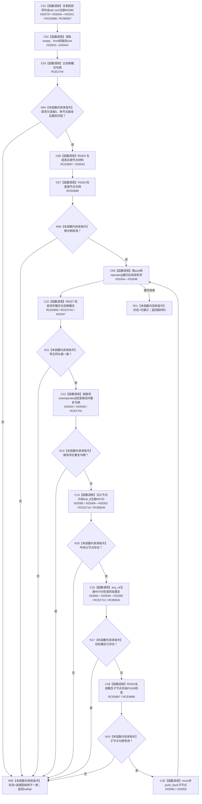

# CF-L10-0033 转换概念树根现状流程图

图类型：现状流程图
代码版本：`3920a74638264f9f539d50f32f3c9fe5fb1982ab`
源码 blob：`b0b4cdc2cd7e7fd6801f36c7a43bc27595ca89d9`
覆盖文件：`海中鱼巣/领域/控制面板服务.h:1060-1141`
唯一根函数：R0279
完整签名：`std::optional<控制面板树节点材料> 海中鱼巣::控制面板服务::转换概念树根(const 抽象树视图材料& 视图, 控制面板请求状态& 状态) const`
参数：视图为只读借用；状态为可写引用
返回结果：投影项结构一致时返回转换后的根节点材料；任一结构异常时写追根因状态并返回空
已登记调用方：RCE1029（R0321）
直接项目函数：RCE0896 → R0280；RCE0897 → R0324；RCE0898 → F0163；RCE0900 → R0527；RCE2710 → R0791；RCE2712 → R0792；RCE2744 → F0051
外部边界：X02079—X02082、X03340—X03353；回调登记：RCB0007、RCB0040、RCB0041；未解析项目调用：0
逐行映射表：`流程图/代码流程图/L10/CF-L10-0033_转换概念树根_逐行代码映射表.md`
依据：关系发布基线 `57c7ef1a4dc96083bd5ea570400c90cae5eaefc5` 与冻结源码
结构读写：只读取抽象树视图并构造局部控制面板树材料
不得作为施工许可：是
不得宣称：转换成功证明抽象树权威结构无其它问题

## 流程图

## 当前边界

- RCE0899 原误绑关系句柄重载 F0168，本批停用；两个句柄有效调用只保留 RCE0898 → F0163。
