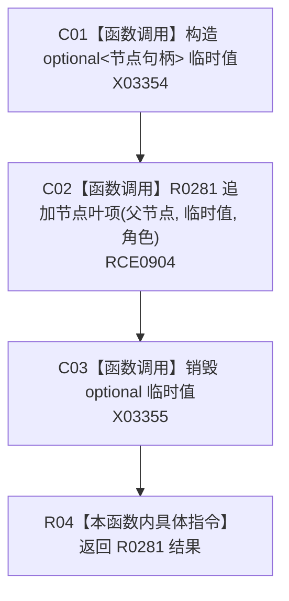

# CF-L10-0034 追加节点叶项具体目标现状流程图

图类型：现状流程图
代码版本：`3920a74638264f9f539d50f32f3c9fe5fb1982ab`
源码 blob：`b0b4cdc2cd7e7fd6801f36c7a43bc27595ca89d9`
覆盖文件：`海中鱼巣/领域/控制面板服务.h:1200-1205`
唯一根函数：R0282
完整签名：`bool 海中鱼巣::控制面板服务::追加节点叶项(控制面板树节点材料& 父节点, 节点句柄 目标, 控制面板树关系角色 角色) const`
参数：父节点为可写借用；目标和角色按值传入
返回结果：把目标提升为 `optional` 后返回 R0281 的追加结果
已登记调用方：RCE0934、RCE0959、RCE0973
直接项目函数：RCE0904 → R0281
外部边界：X03354、X03355；未解析项目调用：0
逐行映射表：`流程图/代码流程图/L10/CF-L10-0034_追加节点叶项具体目标_逐行代码映射表.md`
依据：关系发布基线 `57c7ef1a4dc96083bd5ea570400c90cae5eaefc5` 与冻结源码
结构读写：由 R0281 条件追加调用方局部父节点材料
不得作为施工许可：是
不得宣称：具体句柄必然可以生成有效叶项

## 流程图

## 当前边界

- 临时 `optional` 的生命周期只覆盖本次重载转发调用。
