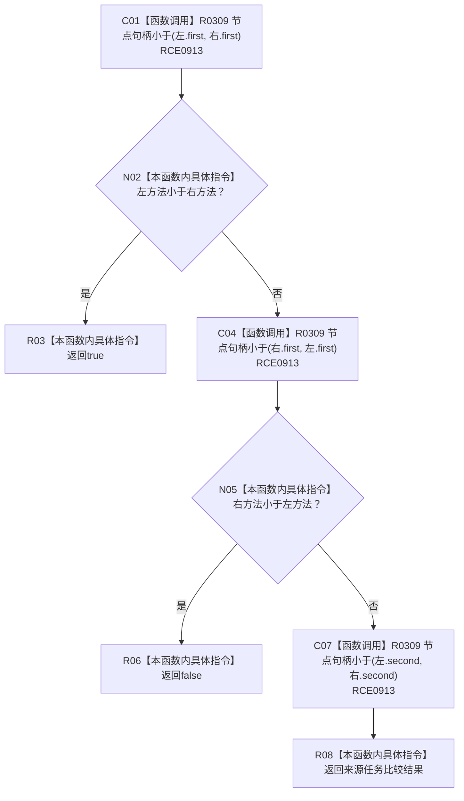

# CF-L10-0035 方法来源排序比较现状流程图

图类型：现状流程图
代码版本：`3920a74638264f9f539d50f32f3c9fe5fb1982ab`
源码 blob：`b0b4cdc2cd7e7fd6801f36c7a43bc27595ca89d9`
覆盖文件：`海中鱼巣/领域/控制面板服务.h:1266-1274`
唯一根函数：R0285
完整签名：`bool 海中鱼巣::控制面板服务::发现方法根组(const std::vector<海中鱼巣::节点句柄>&, std::vector<std::pair<海中鱼巣::节点句柄, 海中鱼巣::节点句柄>>&, 海中鱼巣::控制面板请求状态&) const::<lambda@控制面板服务.h:1266>::operator()(const std::pair<海中鱼巣::节点句柄, 海中鱼巣::节点句柄>& 左, const std::pair<海中鱼巣::节点句柄, 海中鱼巣::节点句柄>& 右) const`
参数：左、右均为方法—来源任务对的只读借用
返回结果：先按方法句柄，再按来源任务句柄返回严格小于结果
已登记调用方：RCE0912 / RCB0008（R0284 的 `std::sort`）
直接项目函数：RCE0913 → R0309
外部边界：无；X02090 为误挂外层 `std::sort`，本批停用；未解析项目调用：0
逐行映射表：`流程图/代码流程图/L10/CF-L10-0035_方法来源排序比较_逐行代码映射表.md`
依据：关系发布基线 `57c7ef1a4dc96083bd5ea570400c90cae5eaefc5` 与冻结源码
结构读写：只读两个方法来源对
不得作为施工许可：是
不得宣称：比较函数验证了方法与任务关系存在

## 流程图

## 当前边界

- `std::sort` 属于 R0284；本 lambda 只提供稳定字典序谓词。
