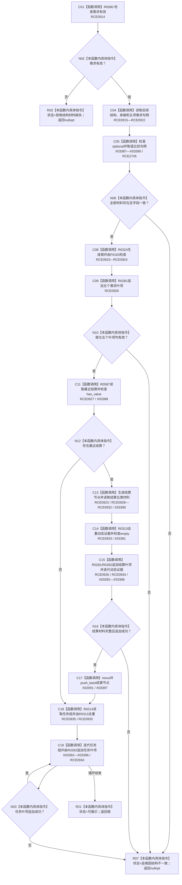

# CF-L10-0036 生成需求根现状流程图

图类型：现状流程图
代码版本：`3920a74638264f9f539d50f32f3c9fe5fb1982ab`
源码 blob：`b0b4cdc2cd7e7fd6801f36c7a43bc27595ca89d9`
覆盖文件：`海中鱼巣/领域/控制面板服务.h:1286-1368`
唯一根函数：R0286
完整签名：`std::optional<控制面板树节点材料> 海中鱼巣::控制面板服务::生成需求根(节点句柄 需求节点, 控制面板请求状态& 状态) const`
参数：需求节点按值传入；状态为可写引用
返回结果：需求、承接、结算和任务材料一致时返回需求根材料；异常时返回空并写状态
已登记调用方：RCE0938（R0287）
直接项目函数：RCE0914—RCE0935；RCE2745 → F0051
外部边界：X02091、X03387—X03397；未解析项目调用：0
逐行映射表：`流程图/代码流程图/L10/CF-L10-0036_生成需求根_逐行代码映射表.md`
依据：关系发布基线 `57c7ef1a4dc96083bd5ea570400c90cae5eaefc5` 与冻结源码
结构读写：只读需求/任务服务材料并构造局部树节点
不得作为施工许可：是
不得宣称：根材料返回证明需求已经结算或任务已经完成

## 流程图

## 当前边界

- RCE0925 原误绑 F0168，本批停用；根与结算节点只调用 F0163（RCE0924）。
