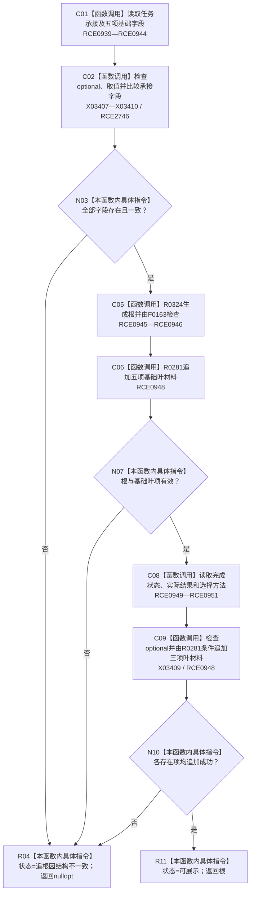

# CF-L10-0037 生成任务根现状流程图

图类型：现状流程图
代码版本：`3920a74638264f9f539d50f32f3c9fe5fb1982ab`
源码 blob：`b0b4cdc2cd7e7fd6801f36c7a43bc27595ca89d9`
覆盖文件：`海中鱼巣/领域/控制面板服务.h:1396-1450`
唯一根函数：R0288
完整签名：`std::optional<控制面板树节点材料> 海中鱼巣::控制面板服务::生成任务根(节点句柄 任务节点, 控制面板请求状态& 状态) const`
参数：任务节点按值传入；状态为可写引用
返回结果：任务承接材料与各独立读取字段一致且叶项追加成功时返回任务根材料，否则返回空
已登记调用方：RCE0954（R0289）
直接项目函数：RCE0939—RCE0951；RCE2746 → F0051
外部边界：X03407—X03410；未解析项目调用：0
逐行映射表：`流程图/代码流程图/L10/CF-L10-0037_生成任务根_逐行代码映射表.md`
依据：关系发布基线 `57c7ef1a4dc96083bd5ea570400c90cae5eaefc5` 与冻结源码
结构读写：只读任务材料并构造局部树节点
不得作为施工许可：是
不得宣称：根材料返回证明任务执行成功

## 流程图

## 当前边界

- RCE0947 原误绑 F0168，本批停用；根节点检查只保留 RCE0946 → F0163。
