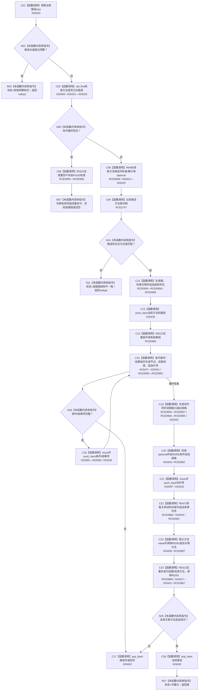

# CF-L10-0038 生成方法节点现状流程图

图类型：现状流程图
代码版本：`3920a74638264f9f539d50f32f3c9fe5fb1982ab`
源码 blob：`b0b4cdc2cd7e7fd6801f36c7a43bc27595ca89d9`
覆盖文件：`海中鱼巣/领域/控制面板服务.h:1478-1596`
唯一根函数：R0290
完整签名：`std::optional<控制面板树节点材料> 海中鱼巣::控制面板服务::生成方法节点(节点句柄 方法节点, 控制面板树关系角色 关系角色, std::vector<节点句柄>& 当前路径, 控制面板请求状态& 状态, std::size_t 深度预算) const`
参数：方法节点和角色按值传入；当前路径、状态为可写引用；深度预算按值传入
返回结果：预算内递归构造完整方法节点时返回材料；循环回访返回重复叶项；其它结构异常返回空
已登记调用方：RCE0968（R0291）、RCE0972（R0292）
直接项目函数：RCE0955—RCE0967；RCE2747 → F0051
外部边界：X02094—X02098、X03420—X03435；未解析项目调用：0
逐行映射表：`流程图/代码流程图/L10/CF-L10-0038_生成方法节点_逐行代码映射表.md`
依据：关系发布基线 `57c7ef1a4dc96083bd5ea570400c90cae5eaefc5` 与冻结源码
结构读写：只读方法材料，维护调用方路径栈并构造局部树材料
不得作为施工许可：是
不得宣称：局部树生成证明方法可执行或条件已满足

## 流程图

## 当前边界

- RCE0957 原误绑 F0168，本批停用；五个节点材料句柄检查只保留 RCE0956 → F0163。
- 每个失败分支在已压栈后都先经 X03432 弹出当前方法。
