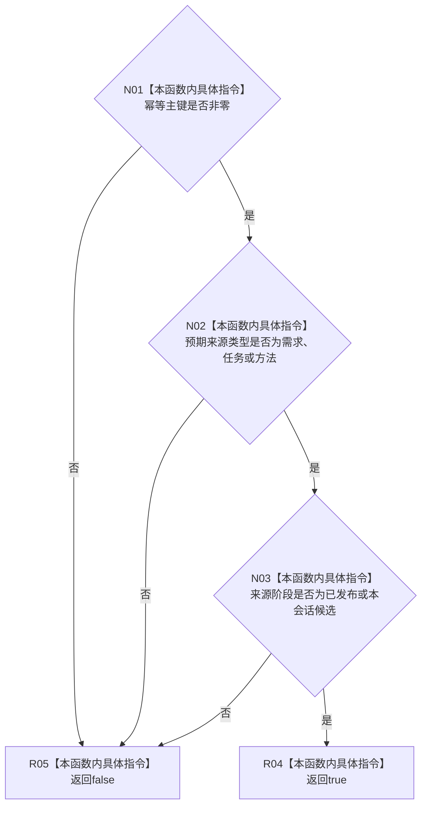

# CF-L10-0039 虚拟存在写入规格完整现状流程图

图类型：现状流程图
代码版本：`3920a74638264f9f539d50f32f3c9fe5fb1982ab`
源码 blob：`524922ab2f3d0d76cfed4bdd517f0d7d57e1ae6a`
覆盖文件：`海中鱼巣/领域/数据操作.存在场景.ixx:92-99`
唯一根函数：R0329
完整签名：`bool 海中鱼巣::虚拟存在写入规格::完整() const noexcept`
参数：无；只读当前规格对象
返回结果：幂等主键非零、来源类型属于需求/任务/方法且来源阶段为已发布或本会话候选时返回 `true`，否则返回 `false`
已登记调用方：R0381、R0382、R0467
直接项目函数：无
外部边界：无；未解析项目调用：0
逐行映射表：`流程图/代码流程图/L10/CF-L10-0039_虚拟存在写入规格完整_逐行代码映射表.md`
依据：关系发布基线 `57c7ef1a4dc96083bd5ea570400c90cae5eaefc5` 与冻结源码
结构读写：只读规格值字段，不修改机器结构
不得作为施工许可：是
不得宣称：规格完整代表对应虚拟存在已经写入或发布

## 流程图

## 当前边界

- 本函数只进行值式规格完整性判断，不读取仓库、关系或索引。
