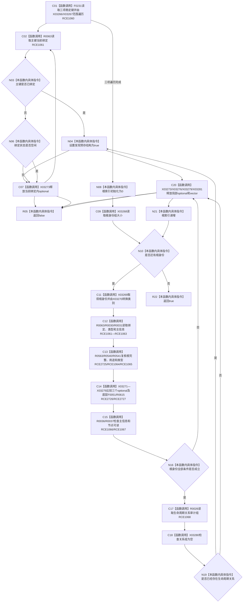

# CF-L10-0040 概念活动复核全新前置会话现状流程图

图类型：现状流程图
代码版本：`3920a74638264f9f539d50f32f3c9fe5fb1982ab`
源码 blob：`0a902454f56f7ee20e65f81ea6864e923a9c7f6a`
覆盖文件：`海中鱼巣/领域/数据操作.概念活动.ixx:211-246`
唯一根函数：R0335
完整签名：`bool 海中鱼巣::概念活动数据操作::复核全新前置_会话(海中鱼巣::结构写入会话& 会话, const 海中鱼巣::概念活动初始化参数& 参数, const std::array<const 海中鱼巣::系统角色身份材料*, 4>& 根身份组, bool& 发现预存结构) const`
参数：会话为可写会话借用；参数和根身份组为只读引用；发现预存结构为可写输出引用
返回结果：三项状态主键均空闲、四个根身份及其绑定/类型/主信息均一致可读且无现有生命周期关系时返回 `true`；否则返回 `false`
已登记调用方：R0341
直接项目函数：RCE1060—RCE1068；RCE2725—RCE2727
外部边界：X03266—X03281
逐行映射表：`流程图/代码流程图/L10/CF-L10-0040_概念活动复核全新前置会话_逐行代码映射表.md`
依据：关系发布基线 `57c7ef1a4dc96083bd5ea570400c90cae5eaefc5` 与冻结源码
结构读写：只读会话候选视图；命中预存绑定或关系时把输出标记设为 `true`
不得作为施工许可：是
不得宣称：返回 `false` 已撤销、清理或修复预存结构

## 流程图

## 当前边界

- `发现预存结构` 只在已绑定状态主键或已存在生命周期关系时置真；其它不一致直接返回 `false`。
