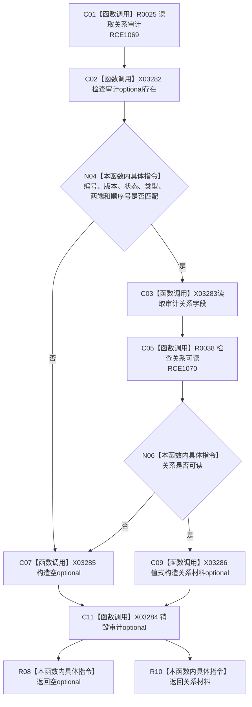

# CF-L10-0041 概念活动读取关系材料会话现状流程图

图类型：现状流程图
代码版本：`3920a74638264f9f539d50f32f3c9fe5fb1982ab`
源码 blob：`0a902454f56f7ee20e65f81ea6864e923a9c7f6a`
覆盖文件：`海中鱼巣/领域/数据操作.概念活动.ixx:248-262`
唯一根函数：R0336
完整签名：`std::optional<海中鱼巣::系统角色关系材料> 海中鱼巣::概念活动数据操作::读取关系材料_会话(海中鱼巣::结构写入会话& 会话, 海中鱼巣::关系句柄 关系, 海中鱼巣::节点句柄 源节点, 海中鱼巣::节点句柄 目标节点, std::int64_t 顺序号) const`
参数：会话为可写会话借用；关系、源节点、目标节点和顺序号按值传入
返回结果：审计关系与全部预期字段一致且关系可读时返回角色关系材料；否则返回空 optional
已登记调用方：R0337、R0341
直接项目函数：RCE1069 → R0025；RCE1070 → R0038
外部边界：X03282—X03286
逐行映射表：`流程图/代码流程图/L10/CF-L10-0041_概念活动读取关系材料会话_逐行代码映射表.md`
依据：关系发布基线 `57c7ef1a4dc96083bd5ea570400c90cae5eaefc5` 与冻结源码
结构读写：只读会话候选/审计视图
不得作为施工许可：是
不得宣称：空 optional 已撤销或删除关系

## 流程图

## 当前边界

- 任一审计字段不一致或会话内关系不可读均返回空值。
