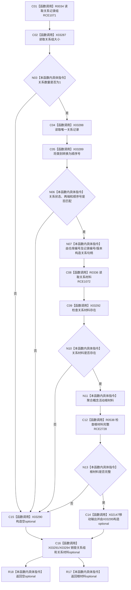

# CF-L10-0042 概念活动重建根会话现状流程图

图类型：现状流程图
代码版本：`3920a74638264f9f539d50f32f3c9fe5fb1982ab`
源码 blob：`0a902454f56f7ee20e65f81ea6864e923a9c7f6a`
覆盖文件：`海中鱼巣/领域/数据操作.概念活动.ixx:264-286`
唯一根函数：R0337
完整签名：`std::optional<海中鱼巣::概念活动根材料> 海中鱼巣::概念活动数据操作::重建根_会话(海中鱼巣::结构写入会话& 会话, 海中鱼巣::概念根类别 类别, const 海中鱼巣::系统角色身份材料& 根身份, const 海中鱼巣::概念活动状态角色材料& 活跃角色, const 海中鱼巣::概念签名材料& 签名) const`
参数：会话为可写会话借用；类别按值；其余材料为只读引用
返回结果：唯一有效生命周期关系、审计材料和根材料完整时返回根材料 optional，否则返回空 optional
已登记调用方：R0341
直接项目函数：RCE1071 → R0034；RCE1072 → R0336；RCE2728 → R0538
外部边界：X02147、X03287—X03295
逐行映射表：`流程图/代码流程图/L10/CF-L10-0042_概念活动重建根会话_逐行代码映射表.md`
依据：关系发布基线 `57c7ef1a4dc96083bd5ea570400c90cae5eaefc5` 与冻结源码
结构读写：只读会话关系记录与审计视图
不得作为施工许可：是
不得宣称：空 optional 已修复关系缺失或字段漂移

## 流程图

## 当前边界

- 关系数量不是一、关系字段漂移、审计失败或输出不完整都收口为空 optional。
