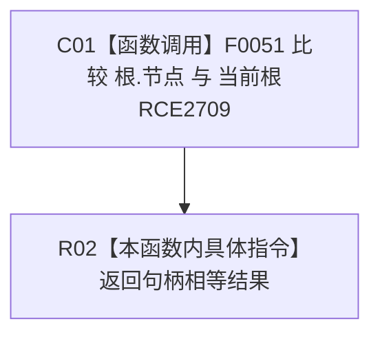

# CF-L10-0043 语素根匹配谓词现状流程图

图类型：现状流程图
代码版本：`3920a74638264f9f539d50f32f3c9fe5fb1982ab`
源码 blob：`b0b4cdc2cd7e7fd6801f36c7a43bc27595ca89d9`
覆盖文件：`海中鱼巣/领域/控制面板服务.h:1034-1036`
唯一根函数：R0790
完整签名：`bool 海中鱼巣::控制面板服务::生成语素树(const std::vector<海中鱼巣::节点句柄>&, 海中鱼巣::控制面板请求状态&) const::<lambda@控制面板服务.h:1034>::operator()(const 海中鱼巣::控制面板树节点材料& 根) const`
参数：根为候选树节点材料的只读借用；捕获当前根句柄的只读引用
返回结果：候选根节点句柄等于当前根时返回真
已登记调用方：RCE2708 / RCB0039（R0278 的 `std::find_if`）
直接项目函数：RCE2709 → F0051
外部边界：无；未解析项目调用：0
逐行映射表：`流程图/代码流程图/L10/CF-L10-0043_语素根匹配谓词_逐行代码映射表.md`
依据：关系发布基线 `57c7ef1a4dc96083bd5ea570400c90cae5eaefc5` 与冻结源码
结构读写：只读候选根与捕获句柄
不得作为施工许可：是
不得宣称：匹配成功证明根节点材料完整

## 流程图

## 当前边界

- 本 lambda 由 R0278 注册给 `std::find_if`，只执行句柄相等判断。
