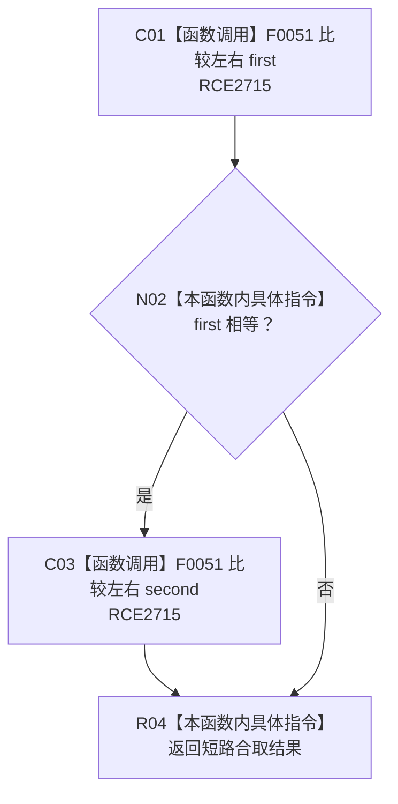

# CF-L10-0044 方法来源对相等谓词现状流程图

图类型：现状流程图
代码版本：`3920a74638264f9f539d50f32f3c9fe5fb1982ab`
源码 blob：`b0b4cdc2cd7e7fd6801f36c7a43bc27595ca89d9`
覆盖文件：`海中鱼巣/领域/控制面板服务.h:1625-1627`
唯一根函数：R0793
完整签名：`bool 海中鱼巣::控制面板服务::生成方法树(std::vector<海中鱼巣::节点句柄>, std::vector<std::pair<海中鱼巣::节点句柄, 海中鱼巣::节点句柄>>, 海中鱼巣::控制面板请求状态&, std::size_t) const::<lambda@控制面板服务.h:1625>::operator()(const std::pair<海中鱼巣::节点句柄, 海中鱼巣::节点句柄>& 左, const std::pair<海中鱼巣::节点句柄, 海中鱼巣::节点句柄>& 右) const`
参数：左、右均为方法—来源任务对的只读借用
返回结果：first 与 second 两个句柄分别相等时返回真
已登记调用方：RCE2714 / RCB0042（R0292 的 `std::unique`）
直接项目函数：RCE2715 → F0051（第 1626 行两个调用点）
外部边界：无；未解析项目调用：0
逐行映射表：`流程图/代码流程图/L10/CF-L10-0044_方法来源对相等谓词_逐行代码映射表.md`
依据：关系发布基线 `57c7ef1a4dc96083bd5ea570400c90cae5eaefc5` 与冻结源码
结构读写：只读两个方法来源对
不得作为施工许可：是
不得宣称：相等谓词验证了方法来源关系有效

## 流程图

## 当前边界

- `&&` 保持短路；first 不等时不比较 second。
