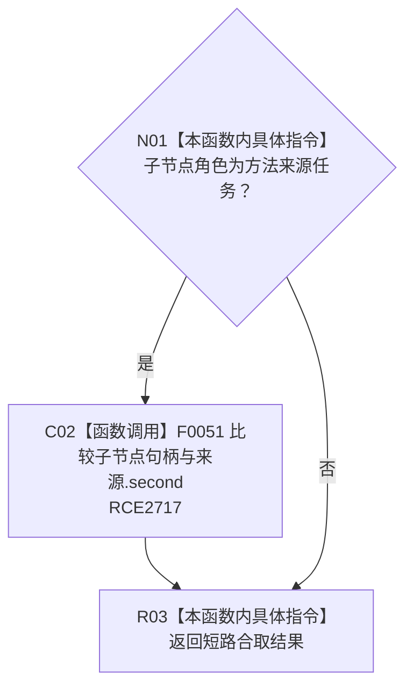

# CF-L10-0045 方法来源子项匹配谓词现状流程图

图类型：现状流程图
代码版本：`3920a74638264f9f539d50f32f3c9fe5fb1982ab`
源码 blob：`b0b4cdc2cd7e7fd6801f36c7a43bc27595ca89d9`
覆盖文件：`海中鱼巣/领域/控制面板服务.h:1642-1645`
唯一根函数：R0794
完整签名：`bool 海中鱼巣::控制面板服务::生成方法树(std::vector<海中鱼巣::节点句柄>, std::vector<std::pair<海中鱼巣::节点句柄, 海中鱼巣::节点句柄>>, 海中鱼巣::控制面板请求状态&, std::size_t) const::<lambda@控制面板服务.h:1642>::operator()(const 海中鱼巣::控制面板树节点材料& 子节点) const`
参数：子节点为只读借用；捕获当前方法来源对
返回结果：子节点角色为方法来源任务且节点等于来源任务时返回真
已登记调用方：RCE2716 / RCB0043（R0292 的 `std::any_of`）
直接项目函数：RCE2717 → F0051
外部边界：无；未解析项目调用：0
逐行映射表：`流程图/代码流程图/L10/CF-L10-0045_方法来源子项匹配谓词_逐行代码映射表.md`
依据：关系发布基线 `57c7ef1a4dc96083bd5ea570400c90cae5eaefc5` 与冻结源码
结构读写：只读子节点与捕获的来源任务
不得作为施工许可：是
不得宣称：未命中证明其它方法节点没有同一来源任务

## 流程图

## 当前边界

- 角色不匹配时 `&&` 短路，不执行句柄比较。
