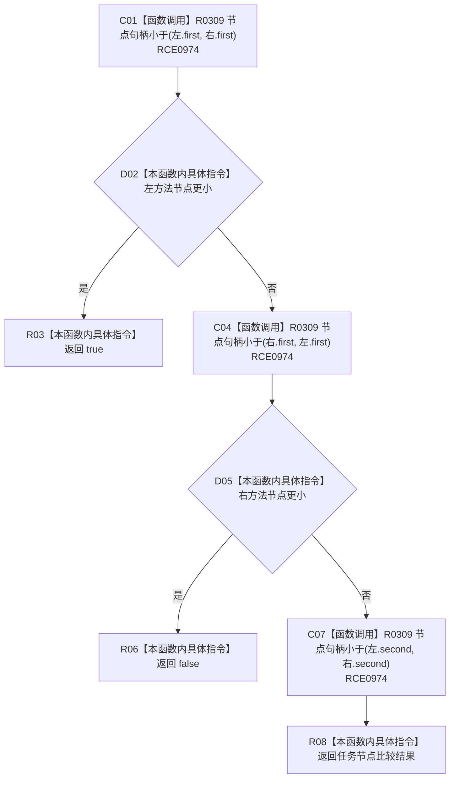

# CF-L10-0046 方法来源任务排序比较现状流程图

图类型：现状流程图
代码版本：`3920a74638264f9f539d50f32f3c9fe5fb1982ab`
源码 blob：`b0b4cdc2cd7e7fd6801f36c7a43bc27595ca89d9`
覆盖文件：`海中鱼巣/领域/控制面板服务.h:1615-1623`
唯一根函数：R0293
完整签名：`bool 海中鱼巣::控制面板服务::生成方法树(std::vector<海中鱼巣::节点句柄>, std::vector<std::pair<海中鱼巣::节点句柄, 海中鱼巣::节点句柄>>, 海中鱼巣::控制面板请求状态&, std::size_t) const::<lambda@控制面板服务.h:1615>::operator()(const std::pair<海中鱼巣::节点句柄, 海中鱼巣::节点句柄>& 左, const std::pair<海中鱼巣::节点句柄, 海中鱼巣::节点句柄>& 右) const`
参数：左右方法来源任务对均以 const 引用借用
返回结果：先按方法节点、再按任务节点比较，左项应排在右项前时返回 `true`
已登记调用方：R0292（RCE0971；RCB0009）
直接项目函数：R0309（RCE0974，三处）
外部边界：无；X02107 已建议停用
逐行映射表：`流程图/代码流程图/L10/CF-L10-0046_方法来源任务排序比较_逐行代码映射表.md`
依据：冻结源码、RCE0971、RCE0974、RCB0009；外层 `std::sort` 由 R0292 的 X02103 登记
结构读写：无，只读比较
不得作为施工许可：是
不得宣称：比较器执行排序算法或修改来源对

## 流程图

## 当前边界

- X02107 位于 lambda 注册行但实际 `std::sort` 调用者是 R0292；本图不把它伪写成 R0293 外部调用。
