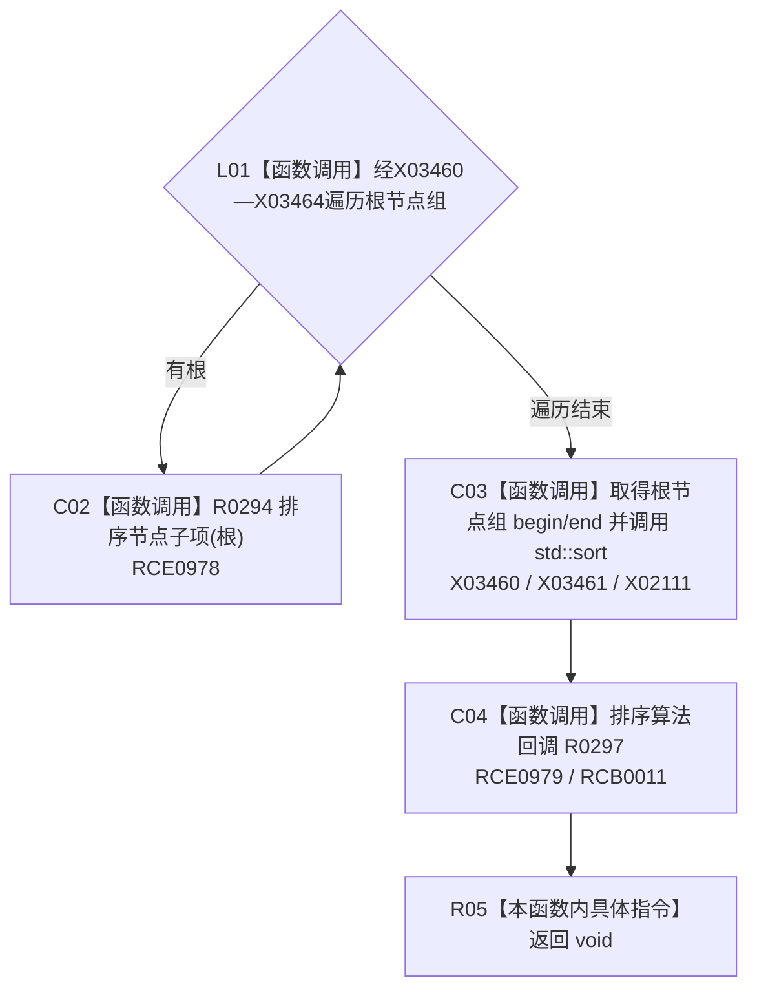

# CF-L10-0047 排序树结构现状流程图

图类型：现状流程图
代码版本：`3920a74638264f9f539d50f32f3c9fe5fb1982ab`
源码 blob：`b0b4cdc2cd7e7fd6801f36c7a43bc27595ca89d9`
覆盖文件：`海中鱼巣/领域/控制面板服务.h:1678-1685`
唯一根函数：R0296
完整签名：`static void 海中鱼巣::控制面板服务::排序树结构(控制面板树结构材料& 树)`
参数：树结构材料以可写引用借用
返回结果：`void`；先排序每个根的子项，再排序根节点组
已登记调用方：R0320（RCE1013）
直接项目函数：R0294（RCE0978）、R0297（RCE0979；RCB0011）
外部边界：X02111；X03460—X03464
逐行映射表：`流程图/代码流程图/L10/CF-L10-0047_排序树结构_逐行代码映射表.md`
依据：冻结源码与既有项目边、回调、符号外部边界
结构读写：原位排序树的全部子项和根节点组
不得作为施工许可：是
不得宣称：排序会增加、删除或去重节点

## 流程图

## 当前边界

- 根比较细节属于 R0297 的独立现状图。
