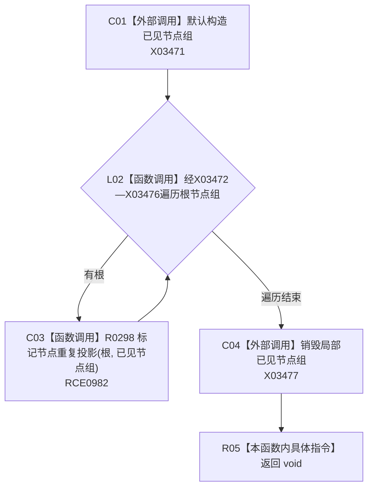

# CF-L10-0048 标记重复投影现状流程图

图类型：现状流程图
代码版本：`3920a74638264f9f539d50f32f3c9fe5fb1982ab`
源码 blob：`b0b4cdc2cd7e7fd6801f36c7a43bc27595ca89d9`
覆盖文件：`海中鱼巣/领域/控制面板服务.h:1700-1705`
唯一根函数：R0299
完整签名：`static void 海中鱼巣::控制面板服务::标记重复投影(控制面板树结构材料& 树)`
参数：树结构材料以可写引用借用
返回结果：`void`；用同一已见组遍历全部根并标记重复投影
已登记调用方：R0320（RCE1014）
直接项目函数：R0298（RCE0982）
外部边界：X03471—X03477
逐行映射表：`流程图/代码流程图/L10/CF-L10-0048_标记重复投影_逐行代码映射表.md`
依据：冻结源码、RCE0982、RCE1014 与符号外部边界
结构读写：构造局部已见组并写整棵树的重复投影标记
不得作为施工许可：是
不得宣称：已见组在函数返回后保留

## 流程图

## 当前边界

- 所有根共享同一局部已见组，因此跨根出现同一节点也会被标记为重复投影。
