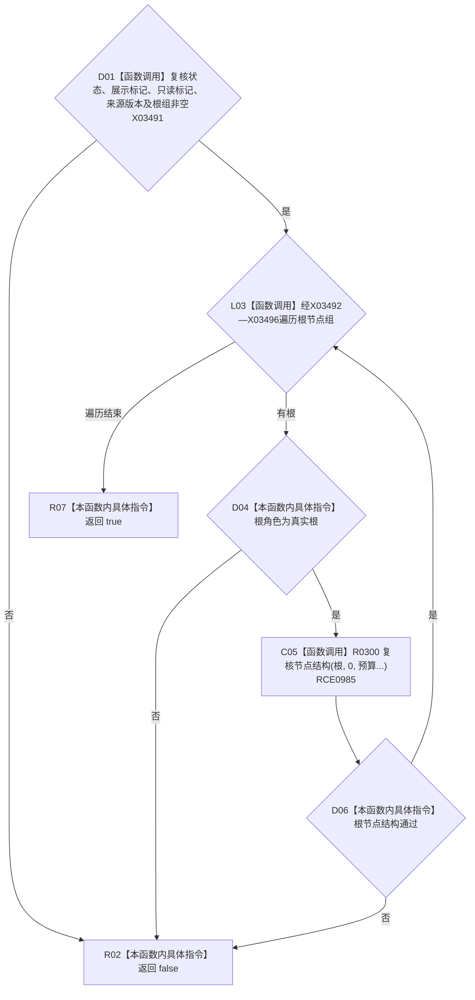

# CF-L10-0049 复核树结构现状流程图

图类型：现状流程图
代码版本：`3920a74638264f9f539d50f32f3c9fe5fb1982ab`
源码 blob：`b0b4cdc2cd7e7fd6801f36c7a43bc27595ca89d9`
覆盖文件：`海中鱼巣/领域/控制面板服务.h:1742-1762`
唯一根函数：R0301
完整签名：`bool 海中鱼巣::控制面板服务::复核树结构(const 控制面板树结构材料& 树, std::size_t 节点预算, std::size_t 深度预算, std::size_t& 节点计数, bool& 预算耗尽) const`
参数：树只读借用；两个预算按值；节点计数和预算耗尽以可写引用传入
返回结果：树头字段有效、根组非空且全部真实根递归复核通过时返回 `true`
已登记调用方：R0320（RCE1015）
直接项目函数：R0300（RCE0985）
外部边界：X03491—X03496
逐行映射表：`流程图/代码流程图/L10/CF-L10-0049_复核树结构_逐行代码映射表.md`
依据：冻结源码、RCE0985、RCE1015 与符号外部边界
结构读写：只写调用方传入的节点计数和预算耗尽标记
不得作为施工许可：是
不得宣称：树材料通过即成为新的权威结构

## 流程图

## 当前边界

- `节点计数` 不在本函数入口清零，由调用方负责传入本轮初值。
