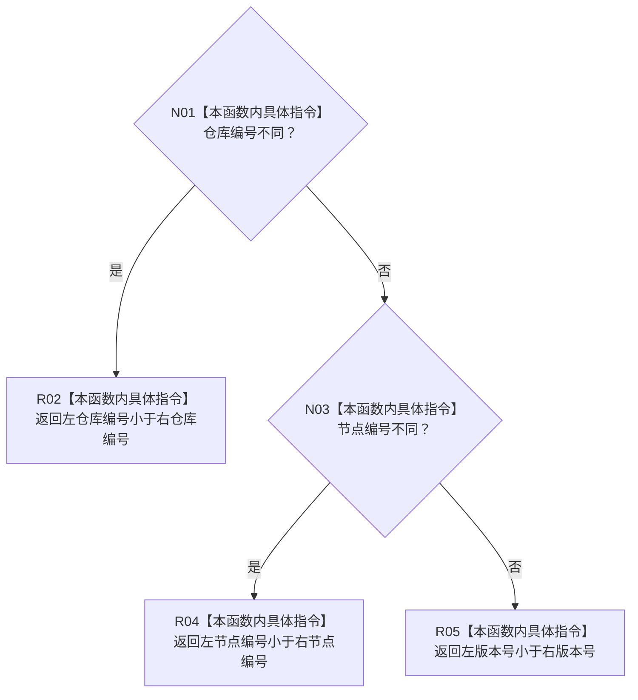

# CF-L10-0050 节点句柄小于现状流程图

图类型：现状流程图
代码版本：`3920a74638264f9f539d50f32f3c9fe5fb1982ab`
源码 blob：`b0b4cdc2cd7e7fd6801f36c7a43bc27595ca89d9`
覆盖文件：`海中鱼巣/领域/控制面板服务.h:578-586`
唯一根函数：R0309
完整签名：`static bool 海中鱼巣::控制面板服务::节点句柄小于(const 海中鱼巣::节点句柄& 左, const 海中鱼巣::节点句柄& 右)`
参数：左右节点句柄均为只读引用
返回结果：按仓库编号、节点编号、版本号依次比较所得的严格小于结果
已登记调用方：RCE0913、RCE0974、RCE0977、RCE0980、RCE1007、RCE1031；待补调用方：RCE2750（R0310）
直接项目函数：无；外部边界：无；未解析项目调用：0
逐行映射表：`流程图/代码流程图/L10/CF-L10-0050_节点句柄小于_逐行代码映射表.md`
依据：冻结源码与当前正式调用关系
结构读写：无，只比较两个值
不得作为施工许可：是
不得宣称：比较结果证明句柄有效或节点存在

## 流程图

## 当前边界

- 本函数不检查任一字段是否为零，也不读取节点仓库。
- R0310 通过 `std::lexicographical_compare` 注册本函数作为谓词，正式聚合表尚缺 RCE2750。
