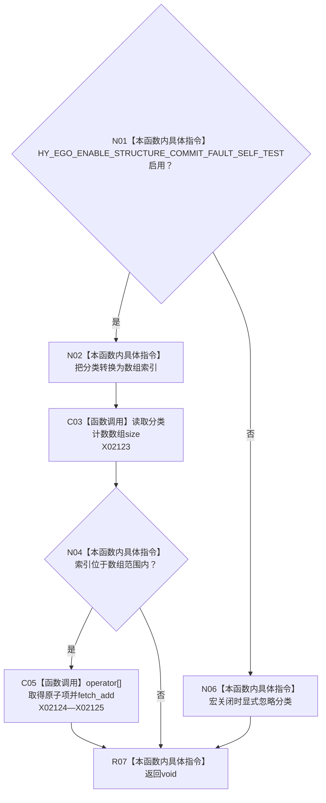

# CF-L10-0051 记录分类构造调用现状流程图

图类型：现状流程图
代码版本：`3920a74638264f9f539d50f32f3c9fe5fb1982ab`
源码 blob：`b0b4cdc2cd7e7fd6801f36c7a43bc27595ca89d9`
覆盖文件：`海中鱼巣/领域/控制面板服务.h:630-639`
唯一根函数：R0314
完整签名：`void 海中鱼巣::控制面板服务::记录分类构造调用(控制面板树分类 分类) const`
参数：分类按值传入
返回结果：`void`
已登记调用方：RCE0893、RCE0936、RCE0952、RCE0969、RCE1016、RCE1042
直接项目函数：无；外部边界：X02123—X02125；未解析项目调用：0
逐行映射表：`流程图/代码流程图/L10/CF-L10-0051_记录分类构造调用_逐行代码映射表.md`
依据：冻结源码、Debug|x64 当前宏配置与正式调用关系
结构读写：故障自检宏启用时递增内存原子诊断计数；关闭时不产生结构变化
不得作为施工许可：是
不得宣称：诊断计数是业务构造事实或权威机器状态

## 流程图

## 当前边界

- 该计数仅为条件编译自检诊断，不改变树材料和仓库事实。
