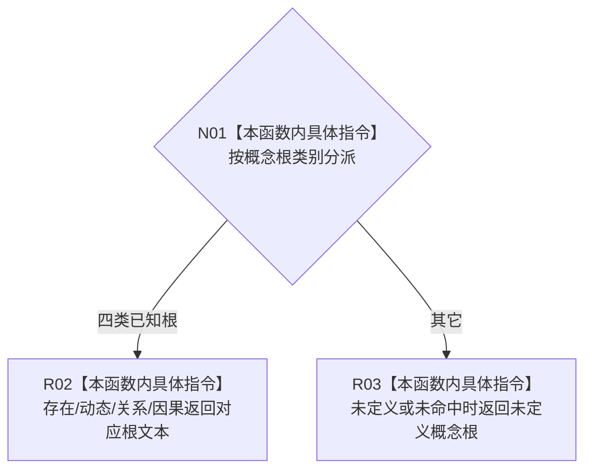

# CF-L10-0052 概念根类别文本现状流程图

图类型：现状流程图
代码版本：`3920a74638264f9f539d50f32f3c9fe5fb1982ab`
源码 blob：`b0b4cdc2cd7e7fd6801f36c7a43bc27595ca89d9`
覆盖文件：`海中鱼巣/领域/控制面板服务.h:641-650`
唯一根函数：R0315
完整签名：`static const wchar_t* 海中鱼巣::控制面板服务::概念根类别文本(概念根类别 类别)`
参数：概念根类别按值传入
返回结果：存在、动态、关系、因果分别返回固定中文文本；其它值返回“未定义概念根”
已登记调用方：RCE1024（R0321）
直接项目函数：无；外部边界：无；未解析项目调用：0
逐行映射表：`流程图/代码流程图/L10/CF-L10-0052_概念根类别文本_逐行代码映射表.md`
依据：冻结源码与当前正式调用关系
结构读写：无，只形成显示文本
不得作为施工许可：是
不得宣称：类别文本是概念根登记或活动状态事实

## 流程图

## 当前边界

- 本函数不读取概念图，也不判断类别是否已登记。
