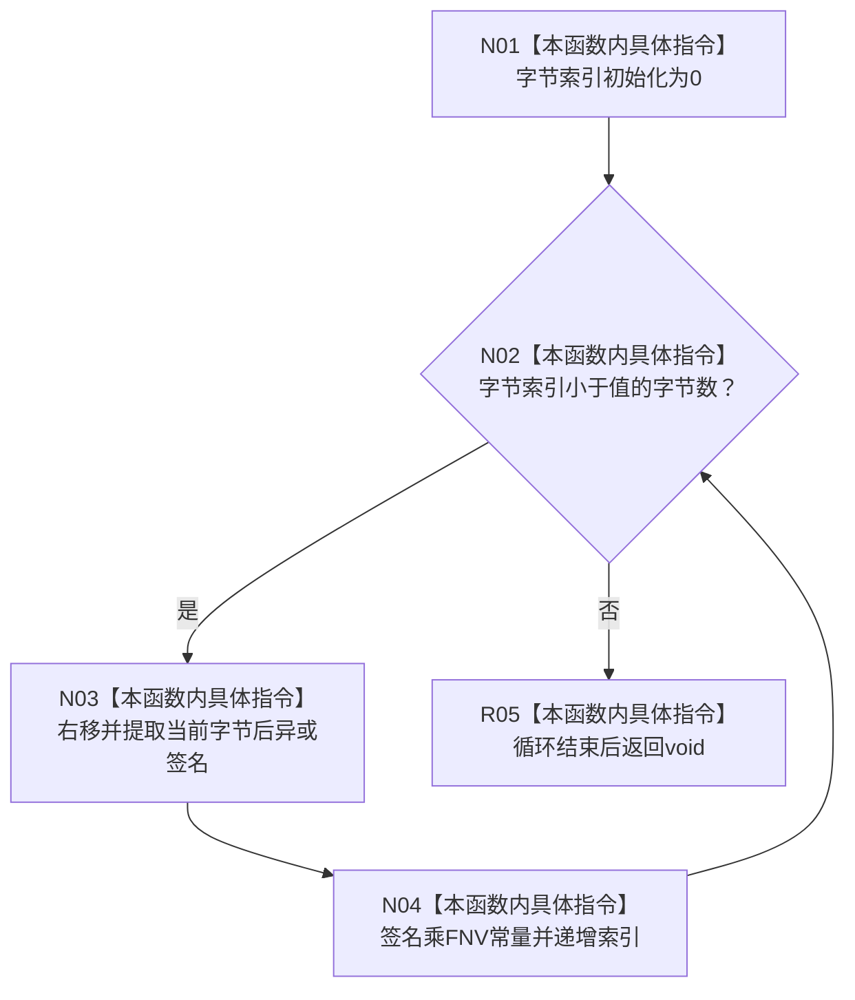

# CF-L10-0053 混合根集签名现状流程图

图类型：现状流程图
代码版本：`3920a74638264f9f539d50f32f3c9fe5fb1982ab`
源码 blob：`b0b4cdc2cd7e7fd6801f36c7a43bc27595ca89d9`
覆盖文件：`海中鱼巣/领域/控制面板服务.h:652-657`
唯一根函数：R0316
完整签名：`static void 海中鱼巣::控制面板服务::混合根集签名(std::uint64_t& 签名, std::uint64_t 值)`
参数：签名为可写引用；值按值传入
返回结果：`void`，八个字节依次混入签名
已登记调用方：RCE1008（R0317）
直接项目函数：无；外部边界：无；未解析项目调用：0
逐行映射表：`流程图/代码流程图/L10/CF-L10-0053_混合根集签名_逐行代码映射表.md`
依据：冻结源码与当前正式调用关系
结构读写：只改调用方传入的局部签名值
不得作为施工许可：是
不得宣称：该签名是密码学摘要或稳定持久身份

## 流程图

## 当前边界

- 函数固定按 `sizeof(std::uint64_t)` 个字节混合，不读写任何仓库。
