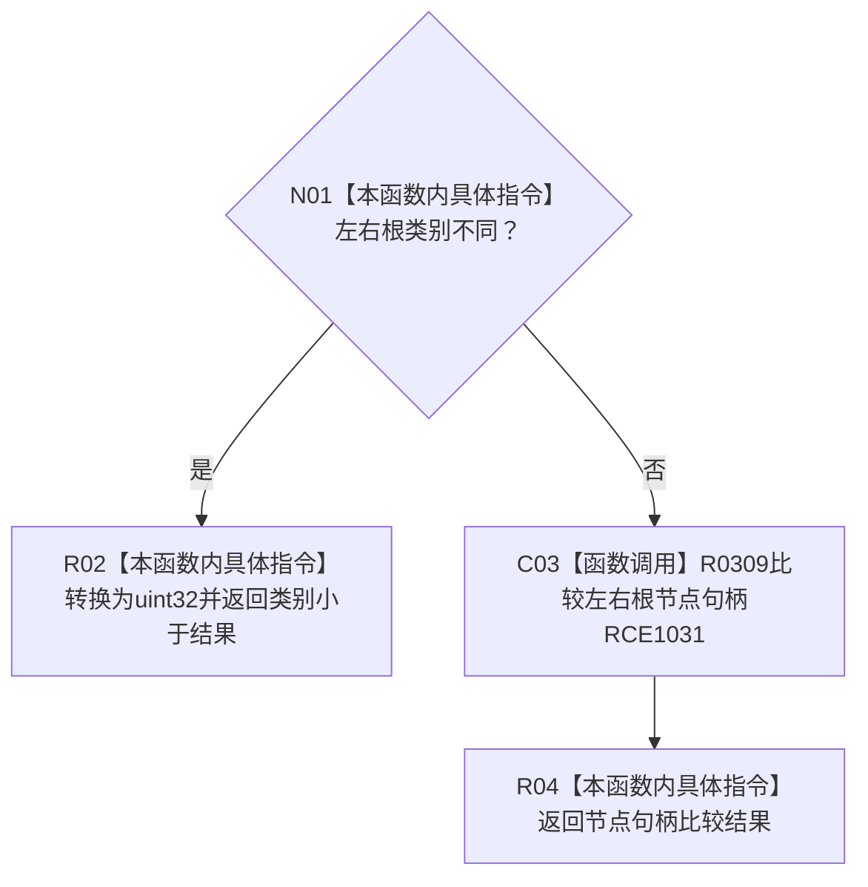

# CF-L10-0054 概念根登记排序 lambda 现状流程图

图类型：现状流程图
代码版本：`3920a74638264f9f539d50f32f3c9fe5fb1982ab`
源码 blob：`b0b4cdc2cd7e7fd6801f36c7a43bc27595ca89d9`
覆盖文件：`海中鱼巣/领域/控制面板服务.h:773-779`
唯一根函数：R0322
完整签名：`bool 海中鱼巣::控制面板服务::生成当前概念根树(const 海中鱼巣::控制面板按需树请求&) const::<lambda@控制面板服务.h:773>::operator()(const 海中鱼巣::概念根登记材料& 左, const 海中鱼巣::概念根登记材料& 右) const`
参数：左右概念根登记材料均为只读引用
返回结果：类别不同时按类别数值比较，否则按根节点句柄比较
已登记调用方：RCE1021（R0321）；回调登记：RCB0005
直接项目函数：RCE1031 → R0309；外部边界：无；X02138 为外层 `std::sort` 误归属并停用
逐行映射表：`流程图/代码流程图/L10/CF-L10-0054_概念根登记排序lambda_逐行代码映射表.md`
依据：冻结源码与当前正式调用关系
结构读写：无，只比较两项登记
不得作为施工许可：是
不得宣称：排序比较证明登记项完整或活动

## 流程图

## 当前边界

- `std::sort` 调用属于外层 R0321 的 X02129；X02138 不应重复挂到 lambda。
