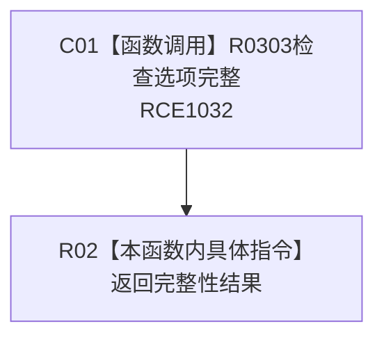

# CF-L10-0055 概念根选项完整性 lambda 现状流程图

图类型：现状流程图
代码版本：`3920a74638264f9f539d50f32f3c9fe5fb1982ab`
源码 blob：`b0b4cdc2cd7e7fd6801f36c7a43bc27595ca89d9`
覆盖文件：`海中鱼巣/领域/控制面板服务.h:808-810`
唯一根函数：R0323
完整签名：`bool 海中鱼巣::控制面板服务::生成当前概念根树(const 海中鱼巣::控制面板按需树请求&) const::<lambda@控制面板服务.h:808>::operator()(const 海中鱼巣::控制面板概念根选项& 选项) const`
参数：选项为只读引用
返回结果：返回选项自身完整性判断
已登记调用方：RCE1025（R0321）；回调登记：RCB0006
直接项目函数：RCE1032 → R0303；外部边界：无；X02139 为外层 `std::all_of` 误归属并停用
逐行映射表：`流程图/代码流程图/L10/CF-L10-0055_概念根选项完整性lambda_逐行代码映射表.md`
依据：冻结源码与当前正式调用关系
结构读写：无，只读选项
不得作为施工许可：是
不得宣称：单项完整证明整组根登记或活动图一致

## 流程图

## 当前边界

- `std::all_of` 调用属于外层 R0321 的 X02134；X02139 不应重复挂到 lambda。
