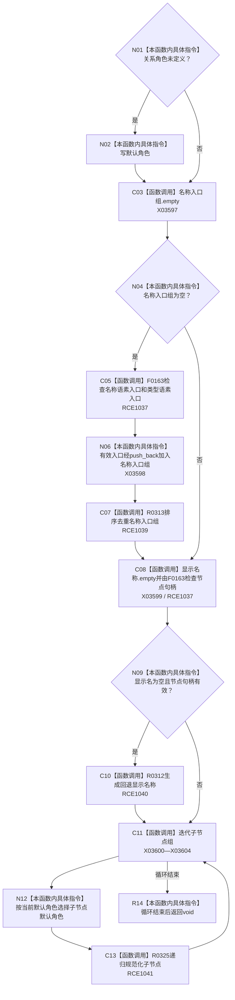

# CF-L10-0056 规范化预绑定节点现状流程图

图类型：现状流程图
代码版本：`3920a74638264f9f539d50f32f3c9fe5fb1982ab`
源码 blob：`b0b4cdc2cd7e7fd6801f36c7a43bc27595ca89d9`
覆盖文件：`海中鱼巣/领域/控制面板服务.h:903-924`
唯一根函数：R0325
完整签名：`void 海中鱼巣::控制面板服务::规范化预绑定节点(控制面板树节点材料& 节点材料, 控制面板树关系角色 默认角色) const`
参数：节点材料为可写引用；默认角色按值传入
返回结果：`void`，原地补齐角色、名称入口组、显示名称并递归规范化子节点
已登记调用方：RCE0894（R0278）、RCE1043（R0326）、RCE1041（自递归）
直接项目函数：RCE1037 → F0163、RCE1039 → R0313、RCE1040 → R0312、RCE1041 → R0325；RCE1038 → F0168 误绑停用
外部边界：X03597—X03604；未解析项目调用：0
逐行映射表：`流程图/代码流程图/L10/CF-L10-0056_规范化预绑定节点_逐行代码映射表.md`
依据：冻结源码、字段静态类型与当前正式调用关系
结构读写：只原地改写调用方提供的非权威树节点材料
不得作为施工许可：是
不得宣称：规范化显示材料修复了底层节点、关系或预绑定结构

## 流程图

## 当前边界

- 第 908、911、916 行三个实参都是 `节点句柄`，只匹配 F0163；RCE1038 的关系句柄重载绑定应停用。
