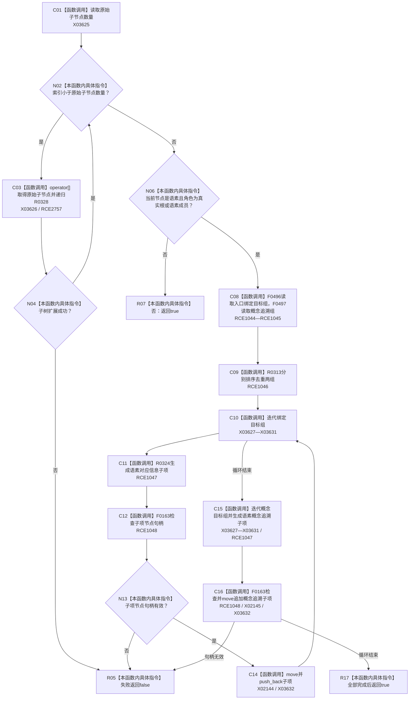

# CF-L10-0057 扩展语素真实关系现状流程图

图类型：现状流程图
代码版本：`3920a74638264f9f539d50f32f3c9fe5fb1982ab`
源码 blob：`b0b4cdc2cd7e7fd6801f36c7a43bc27595ca89d9`
覆盖文件：`海中鱼巣/领域/控制面板服务.h:974-1005`
唯一根函数：R0328
完整签名：`bool 海中鱼巣::控制面板服务::扩展语素真实关系(控制面板树节点材料& 节点材料) const`
参数：节点材料为可写引用，函数递归追加语素对应信息和概念追溯子项
返回结果：全部递归子树和新增子项句柄有效时返回真；任一失败返回假
已登记调用方：RCE0895（R0278）
直接项目函数：RCE1044 → F0496、RCE1045 → F0497、RCE1046 → R0313、RCE1047 → R0324、RCE1048 → F0163；新增 RCE2757 → R0328；RCE1049 → F0168 误绑停用
外部边界：X02144—X02145、X03625—X03632；未解析项目调用：0
逐行映射表：`流程图/代码流程图/L10/CF-L10-0057_扩展语素真实关系_逐行代码映射表.md`
依据：冻结源码、字段静态类型与当前正式调用关系
结构读写：只递归改写调用方提供的非权威控制面板树材料
不得作为施工许可：是
不得宣称：显示树扩展结果是语素关系的第二权威账

## 流程图

## 当前边界

- 第 977 行递归调用在正式聚合表中漏边，应新增 RCE2757。
- 第 992、999 行实参为 `子项.节点`（节点句柄），只匹配 F0163；RCE1049 的 F0168 关系句柄重载绑定应停用。
- 只递归初始 `原子节点数` 个子节点，本轮新增的语素关系子项不会在同次调用中再次扩展。
