# CF-L10-0058 特征体系允许特征宿主现状流程图

图类型：现状流程图
代码版本：`3920a74638264f9f539d50f32f3c9fe5fb1982ab`
源码 blob：`a47cd9b07794d30abc6cb9d1df319056105cd596`
覆盖文件：`海中鱼巣/领域/数据操作.特征体系.ixx:1000-1004`
唯一根函数：R0342
完整签名：`static bool 海中鱼巣::特征体系数据操作::允许特征宿主(海中鱼巣::节点类型 类型) noexcept`
参数：节点类型按值传入
返回结果：存在、场景、需求、任务或方法返回 `true`，其它类型返回 `false`
已登记调用方：R0349、R0350、R0389
直接项目函数：无
外部边界：无
逐行映射表：`流程图/代码流程图/L10/CF-L10-0058_特征体系允许特征宿主_逐行代码映射表.md`
不得作为施工许可：是

## 流程图

```mermaid
flowchart TD
    N01{"N01【本函数内具体指令】类型是否属于存在、场景、需求、任务或方法"}
    R02["R02【本函数内具体指令】返回true"]
    R03["R03【本函数内具体指令】返回false"]
    N01 -- 是 --> R02
    N01 -- 否 --> R03
```

## 当前边界

- 本函数只判断固定类型白名单，不读取节点事实。
