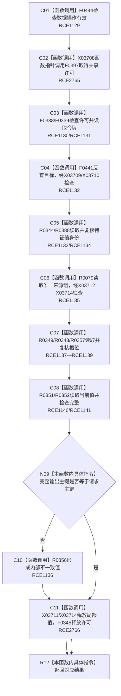

# CF-L10-0060 特征体系读取主键当前值候选现状流程图

图类型：现状流程图
代码版本：`3920a74638264f9f539d50f32f3c9fe5fb1982ab`
源码 blob：`a47cd9b07794d30abc6cb9d1df319056105cd596`
覆盖文件：`海中鱼巣/领域/数据操作.特征体系.ixx:1310-1328`
唯一根函数：R0353
完整签名：`海中鱼巣::特征原始值式材料 海中鱼巣::特征体系数据操作::读取主键当前值候选(std::uint64_t 主键) const`
直接项目函数：RCE1129—RCE1141；RCE2765—RCE2766
符号外部边界：X03708—X03714
逐行映射表：`流程图/代码流程图/L10/CF-L10-0060_特征体系读取主键当前值候选_逐行代码映射表.md`
不得作为施工许可：是

## 流程图

## 当前边界

- 本函数是只读候选查询；共享许可覆盖全部索引、关系、侧表和主信息读回。
