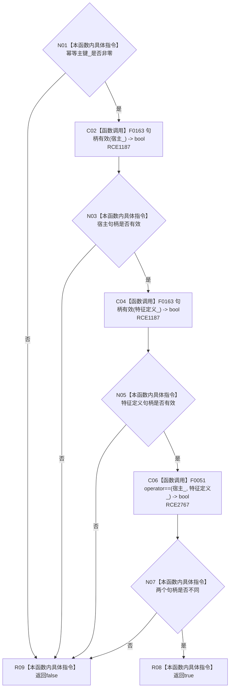

# CF-L10-0061 特征槽位写入规格完整现状流程图

图类型：现状流程图
代码版本：`3920a74638264f9f539d50f32f3c9fe5fb1982ab`
源码 blob：`a47cd9b07794d30abc6cb9d1df319056105cd596`
覆盖文件：`海中鱼巣/领域/数据操作.特征体系.ixx:272-275`
唯一根函数：R0374
完整签名：`bool 海中鱼巣::特征槽位写入规格::完整() const noexcept`
参数：无；只读当前规格对象
返回结果：幂等主键非零、宿主与特征定义句柄均有效且二者不同时返回 true，否则返回 false
已登记调用方：R0389（RCE1217）
直接项目函数：F0163（校正后的 RCE1187）、F0051（RCE2767）
外部边界：无；未解析项目调用：0
逐行映射表：`流程图/代码流程图/L10/CF-L10-0061_特征槽位写入规格完整_逐行代码映射表.md`
依据：关系发布基线 `8d93afa94c066dd8728938e2a40f3a9f3c0c0d52` 与冻结源码
结构读取与写入：只读规格字段
逻辑内返回：任一完整性条件不成立时返回 false
不得作为施工许可：是
不得宣称：规格完整表示宿主和定义已从仓库读回

## 流程图

## 当前边界

- `&&` 按从左到右短路；后项只有在前项为 true 时才求值。
- 旧 RCE1187 的 F0168 关系句柄重载目标与两个节点句柄实参不相容，本批校正为 F0163。
