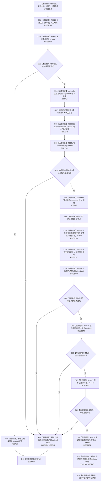

# CF-L10-0062 特征体系写入带主键节点会话现状流程图

图类型：现状流程图
代码版本：`3920a74638264f9f539d50f32f3c9fe5fb1982ab`
源码 blob：`a47cd9b07794d30abc6cb9d1df319056105cd596`
覆盖文件：`海中鱼巣/领域/数据操作.特征体系.ixx:1440-1456`
唯一根函数：R0358
完整签名：`static bool 海中鱼巣::特征体系数据操作::写入带主键节点_会话(结构写入会话& 会话, 节点类型 类型, std::uint64_t 主键, 主信息句柄& 新主信息, 节点句柄& 新节点)`
参数：`会话` 为结构写入会话引用；`类型`、`主键` 为创建与绑定输入；`新主信息`、`新节点` 为成功路径输出引用
返回结果：候选创建、主键绑定和三项读回检查均成功时返回 true；任一内部写入或读回异常时返回 false
已登记调用方：R0361（RCE1159）、R0362（RCE1165）、R0708（RCE2093）
直接项目函数：R0021（RCE1145）、R0640（RCE2768）、R0022（RCE1146）、R0641（RCE2769）、R0129（RCE1148）、R0027（RCE1147）、R0138（RCE2770）、R0036（RCE1149）、R0037（RCE1150）、R0638（RCE2164）；RCE1151 误绑 R0040，停用
外部边界：X03715（主信息句柄 optional 解引用）、X03716（主信息句柄 optional 析构）、X03717（节点句柄 optional 解引用）、X03718（节点句柄 optional 析构）
未解析项目调用：0
逐行映射表：`流程图/代码流程图/L10/CF-L10-0062_特征体系写入带主键节点会话_逐行代码映射表.md`
依据：关系发布基线、冻结源码、RCE1151 重载误绑停用裁决与 RCE2768—RCE2770
结构读取与写入：在会话候选结构中创建主信息和节点、绑定主键并读回；失败由外层会话事务收口
逻辑内返回：无
内部错误边界：候选创建、绑定或读回不成立均返回 false，属于前置通过后的内部结构异常
不得作为施工许可：是
不得宣称：返回 true 代表事务已经提交或结构已经发布

## 流程图

## 当前边界

- `主结果.成功()`、`节点结果.成功()` 和绑定结果 `.成功()` 分别是 R0640、R0641、R0138 的直接调用；三条项目边在原聚合中缺失。
- 第 1455 行是双参数 `主键绑定匹配(std::uint64_t, 节点句柄)`，只匹配 R0638；RCE1151 指向单参数 R0040，属于重载误绑并停用。
- 所有 false 分支都发生在结构写入会话内部；本函数不提交事务，也不把局部候选发布为可读结构。
