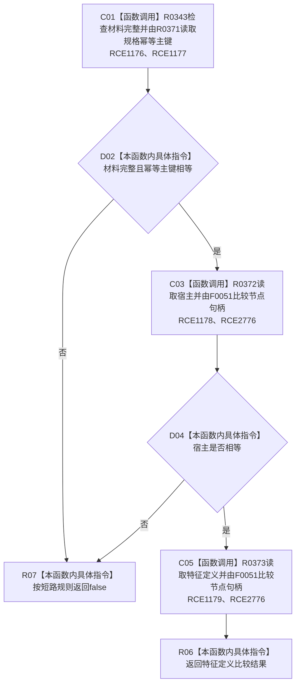

# CF-L10-0063 特征体系匹配槽位现状流程图

图类型：现状流程图
代码版本：`3920a74638264f9f539d50f32f3c9fe5fb1982ab`
源码 blob：`a47cd9b07794d30abc6cb9d1df319056105cd596`
覆盖文件：`海中鱼巣/领域/数据操作.特征体系.ixx:1562-1568`
唯一根函数：R0363
完整签名：`static bool 海中鱼巣::特征体系数据操作::匹配槽位(const 特征槽位值式材料& 材料, const 特征槽位写入规格& 规格) noexcept`
参数：`材料` 与 `规格` 均为只读借用引用；函数不延长其生命周期
返回结果：材料完整且幂等主键、宿主和特征定义全部匹配时返回 `true`，否则按短路求值返回 `false`
调用图：`流程图/主程序可达调用关系/01_main可达项目调用边表.md`
已登记调用方：R0389（RCE1226）
直接项目函数：R0343（RCE1176）、R0371（RCE1177）、R0372（RCE1178）、R0373（RCE1179）
直接项目调用：F0051（RCE2776，第 1566、1567 行）
外部边界：无
未解析项目调用：0
逐行映射表：`流程图/代码流程图/L10/CF-L10-0063_特征体系匹配槽位_逐行代码映射表.md`
输入契约 / 调用语境表：本图“输入与返回边界”
非成功返回二分审查表：配对逐行映射的“非成功口径”
偏差清单：RCE2776 已登记并覆盖 F0051 两个调用点
依据提交 / 结构化消息：调用关系基线 `caab8644416dea13ea598b714289d1c86ac05304`；冻结源码提交 `3920a74638264f9f539d50f32f3c9fe5fb1982ab`
验证输出：本批 Mermaid、节点双向、源码覆盖与差异格式检查
结构读取与写入：只读材料与规格字段，不改变机器结构
不得作为施工许可：是
不得宣称：匹配成功表示槽位仍为仓库当前版本

## 流程图

## 输入与返回边界

- 比较顺序固定为完整性、幂等主键、宿主、特征定义；前项失败时后续读取和比较不执行。
- 本函数只做值式材料与写入规格匹配，不读取仓库、不写结构。
