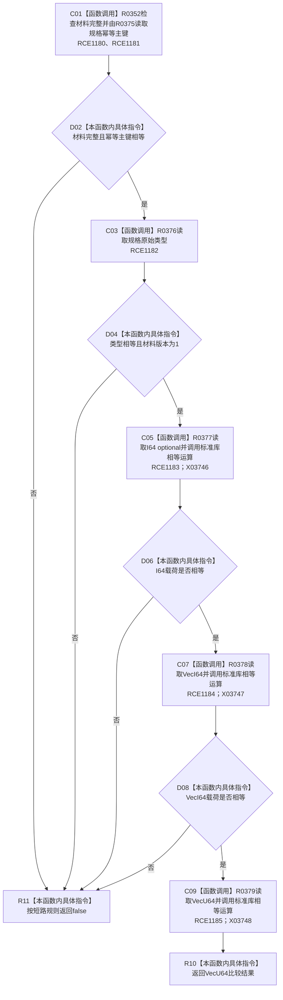

# CF-L10-0064 特征体系匹配原始值现状流程图

图类型：现状流程图
代码版本：`3920a74638264f9f539d50f32f3c9fe5fb1982ab`
源码 blob：`a47cd9b07794d30abc6cb9d1df319056105cd596`
覆盖文件：`海中鱼巣/领域/数据操作.特征体系.ixx:1570-1578`
唯一根函数：R0364
完整签名：`static bool 海中鱼巣::特征体系数据操作::匹配原始值(const 特征原始值式材料& 材料, const 初始特征值写入规格& 规格) noexcept`
参数：`材料` 与 `规格` 均为只读借用引用；函数不延长其生命周期
返回结果：材料完整、幂等主键与类型匹配、版本为 1 且三类载荷全部相等时返回 `true`，否则按短路求值返回 `false`
调用图：`流程图/主程序可达调用关系/01_main可达项目调用边表.md`
已登记调用方：R0389（RCE1227）
直接项目函数：R0352（RCE1180）、R0375（RCE1181）、R0376（RCE1182）、R0377（RCE1183）、R0378（RCE1184）、R0379（RCE1185）
已登记外部边界：X03746（I64 optional 相等，第 1575 行）、X03747（VecI64 相等，第 1576 行）、X03748（VecU64 相等，第 1577 行）
未解析项目调用：0
逐行映射表：`流程图/代码流程图/L10/CF-L10-0064_特征体系匹配原始值_逐行代码映射表.md`
输入契约 / 调用语境表：本图“输入与返回边界”
非成功返回二分审查表：配对逐行映射的“非成功口径”
偏差清单：上述三个标准库相等运算已闭合为 X03746—X03748
依据提交 / 结构化消息：调用关系基线 `caab8644416dea13ea598b714289d1c86ac05304`；冻结源码提交 `3920a74638264f9f539d50f32f3c9fe5fb1982ab`
验证输出：本批 Mermaid、节点双向、源码覆盖与差异格式检查
结构读取与写入：只读材料与规格字段，不改变机器结构
不得作为施工许可：是
不得宣称：匹配成功表示原始值仍为仓库当前版本

## 流程图

## 输入与返回边界

- 比较顺序固定为完整性、幂等主键、原始类型、版本、I64、VecI64、VecU64；前项失败时后续读取和比较不执行。
- 版本要求在本函数中固定为 `1`；这是冻结源码事实，不扩展为目标设计规则。
- 本函数不读取仓库、不写结构。
