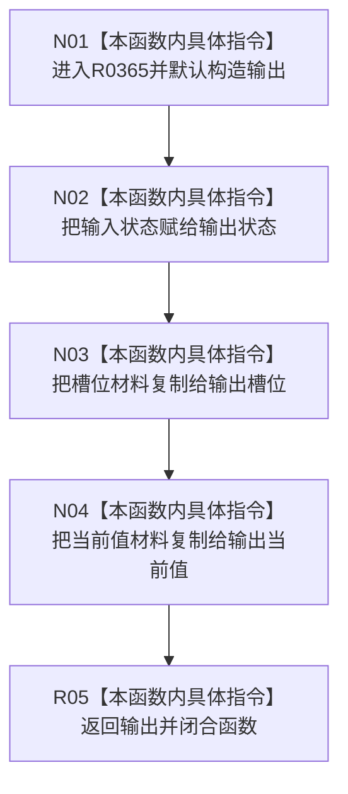

# CF-L10-0065 特征体系形成值结果现状流程图

图类型：现状流程图
代码版本：`3920a74638264f9f539d50f32f3c9fe5fb1982ab`
源码 blob：`a47cd9b07794d30abc6cb9d1df319056105cd596`
覆盖文件：`海中鱼巣/领域/数据操作.特征体系.ixx:1598-1607`
唯一根函数：R0365
完整签名：`static 海中鱼巣::特征体系业务结果 海中鱼巣::特征体系数据操作::形成值结果(特征体系业务状态 状态, const 特征槽位值式材料& 槽位, const 特征原始值式材料& 当前值)`
参数：`状态` 按值传入；`槽位` 与 `当前值` 为只读借用引用
返回结果：返回一个写入指定状态、槽位材料和当前值材料的 `特征体系业务结果`
调用图：`流程图/主程序可达调用关系/01_main可达项目调用边表.md`
已登记调用方：R0389（RCE1228）
直接项目函数：无
外部边界：无
未解析项目调用：0
逐行映射表：`流程图/代码流程图/L10/CF-L10-0065_特征体系形成值结果_逐行代码映射表.md`
输入契约 / 调用语境表：本图“输入与返回边界”
非成功返回二分审查表：配对逐行映射的“非成功口径”
偏差清单：无
依据提交 / 结构化消息：调用关系基线 `caab8644416dea13ea598b714289d1c86ac05304`；冻结源码提交 `3920a74638264f9f539d50f32f3c9fe5fb1982ab`
验证输出：本批 Mermaid、节点双向、源码覆盖与差异格式检查
结构读取与写入：只构造返回值，不读写仓库或其它机器结构
不得作为施工许可：是
不得宣称：结果中的材料已重新从仓库读取或复核为当前版本

## 流程图

## 输入与返回边界

- 本函数不解释或改写输入状态，只把三个输入组合成值式业务结果。
- 槽位与当前值由现有复制赋值语义写入局部输出；本图不把隐式默认特殊成员扩展为已登记外部边界。
