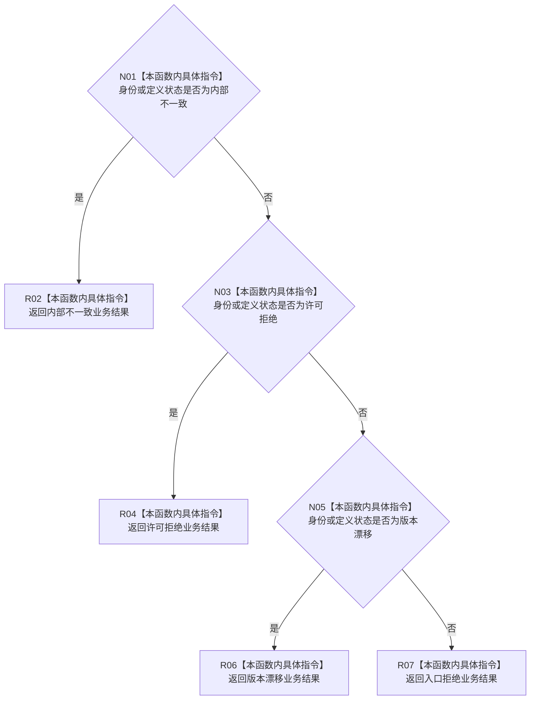

# CF-L10-0066 特征体系合并身份定义失败现状流程图

图类型：现状流程图
代码版本：`3920a74638264f9f539d50f32f3c9fe5fb1982ab`
源码 blob：`a47cd9b07794d30abc6cb9d1df319056105cd596`
覆盖文件：`海中鱼巣/领域/数据操作.特征体系.ixx:1618-1628`
唯一根函数：R0366
完整签名：`static 海中鱼巣::特征体系业务结果 海中鱼巣::特征体系数据操作::合并身份定义失败(const 海中鱼巣::特征节点身份& 身份, const 海中鱼巣::特征定义值式材料& 定义) noexcept`
参数：`身份` 与 `定义` 均为只读借用引用；函数不延长其生命周期
返回结果：按身份和定义的读取状态优先返回内部不一致、许可拒绝、版本漂移或入口拒绝业务结果
调用图：`流程图/主程序可达调用关系/01_main可达项目调用边表.md`
已登记调用方：R0389（RCE1221）
直接项目函数：无
外部边界：无
未解析项目调用：0
逐行映射表：`流程图/代码流程图/L10/CF-L10-0066_特征体系合并身份定义失败_逐行代码映射表.md`
输入契约 / 调用语境表：本图“输入与返回边界”
非成功返回二分审查表：配对逐行映射的“非成功口径”
偏差清单：本批未裁决目标设计偏差；聚合关系纠正项只在批次交接中报告
依据提交 / 结构化消息：调用关系基线 `caab8644416dea13ea598b714289d1c86ac05304`；冻结源码提交 `3920a74638264f9f539d50f32f3c9fe5fb1982ab`
验证输出：本批 Mermaid、节点双向、源码覆盖与差异格式检查
结构读取与写入：只读两个输入状态，不改变机器结构
不得作为施工许可：是
不得宣称：返回内部不一致表示根因已经排除

## 流程图

## 输入与返回边界

- 内部不一致优先于许可拒绝，许可拒绝优先于版本漂移；只有三类状态均未命中时才返回入口拒绝。
- 本函数只合并已有读取状态，不读取仓库、不调用外部边界，也不形成新的机器事实。
