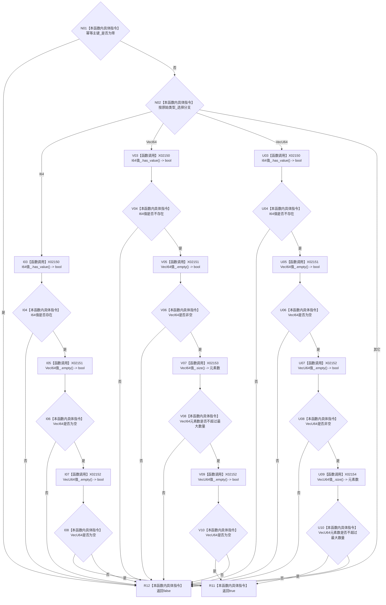

# CF-L10-0067 初始特征值写入规格完整现状流程图

图类型：现状流程图
代码版本：`3920a74638264f9f539d50f32f3c9fe5fb1982ab`
源码 blob：`a47cd9b07794d30abc6cb9d1df319056105cd596`
覆盖文件：`海中鱼巣/领域/数据操作.特征体系.ixx:298-312`
唯一根函数：R0380
完整签名：`bool 海中鱼巣::初始特征值写入规格::完整() const noexcept`
参数：无；只读当前规格对象
返回结果：幂等主键非零，且原始类型与唯一一组非空、受数量上限约束的原始材料相符时返回 `true`；否则返回 `false`
调用图：`流程图/主程序可达调用关系/01_main可达项目调用边表.md`
已登记调用方：R0382、R0389（原入边 RCE1189 已校正为 R0382→R0380；RCE1218）
直接项目函数：无
外部边界：X02150—X02154
未解析项目调用：0
逐行映射表：`流程图/代码流程图/L10/CF-L10-0067_初始特征值写入规格完整_逐行代码映射表.md`
依据提交 / 结构化消息：调用关系发布基线 `caab8644416dea13ea598b714289d1c86ac05304`；冻结源码提交 `3920a74638264f9f539d50f32f3c9fe5fb1982ab`
结构读取与写入：只读规格字段，不改写机器结构
逻辑内返回：主键为零、类型未知、材料缺失、材料类型互斥失败或向量超过上限时返回 `false`
内部错误边界：无
不得作为施工许可：是
不得宣称：规格完整表示对应特征值节点、槽位关系或原始材料已经写入或发布

## 流程图

## 当前边界

- 三个类型分支均按 `&&` 从左到右短路，前项不成立时后续标准库调用不会执行。
- `VecI64` 与 `VecU64` 分支要求对应向量非空且不超过 `特征值服务::最大序列元素数量`。
- 原聚合 RCE1189 误指向 `虚拟存在写入规格::完整()`；实际静态接收者为 `初始特征值写入规格`，已按同一稳定 ID 校正为 R0382→R0380。
