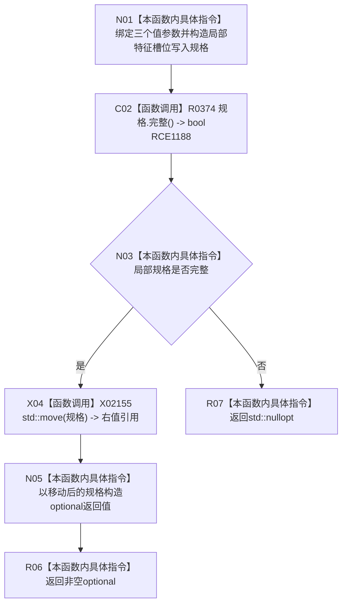

# CF-L10-0068 特征体系形成特征槽位写入规格现状流程图

图类型：现状流程图
代码版本：`3920a74638264f9f539d50f32f3c9fe5fb1982ab`
源码 blob：`a47cd9b07794d30abc6cb9d1df319056105cd596`
覆盖文件：`海中鱼巣/领域/数据操作.特征体系.ixx:475-483`
唯一根函数：R0381
完整签名：`std::optional<特征槽位写入规格> 海中鱼巣::特征体系数据操作::形成特征槽位写入规格(std::uint64_t 幂等主键, 节点句柄 宿主, 节点句柄 特征定义) const`
参数：`幂等主键`、`宿主`、`特征定义` 均按值输入；本函数不取得仓库许可
返回结果：局部规格完整时移动构造并返回 `optional<特征槽位写入规格>`；否则返回 `std::nullopt`
调用图：`流程图/主程序可达调用关系/01_main可达项目调用边表.md`
已登记调用方：R0502（RCE1510）
直接项目函数：R0374（校正后的 RCE1188）
外部边界：X02155（已精确为 `std::move<特征槽位写入规格&>`）
未解析项目调用：0
逐行映射表：`流程图/代码流程图/L10/CF-L10-0068_特征体系形成特征槽位写入规格_逐行代码映射表.md`
依据提交 / 结构化消息：调用关系发布基线 `caab8644416dea13ea598b714289d1c86ac05304`；冻结源码提交 `3920a74638264f9f539d50f32f3c9fe5fb1982ab`
结构读取与写入：只构造并返回值式规格；不读取或写入仓库、关系或索引
逻辑内返回：规格完整性不成立时返回空 optional
内部错误边界：无
不得作为施工许可：是
不得宣称：返回非空规格表示槽位节点或关系已经创建、提交或发布

## 流程图

## 当前边界

- 本函数只形成值式请求规格；R0374 只检查主键、两个节点句柄及二者不相同。
- 原聚合 RCE1188 误指向 `虚拟存在写入规格::完整()`；第 480 行接收者的静态类型唯一绑定 R0374。
- X02155 的精确签名为 `海中鱼巣::特征槽位写入规格&& std::move<海中鱼巣::特征槽位写入规格&>(海中鱼巣::特征槽位写入规格&) noexcept`。
