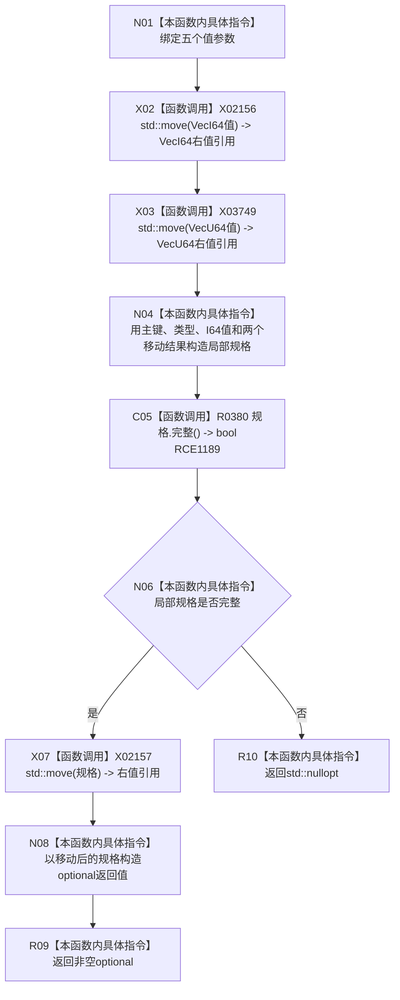

# CF-L10-0069 特征体系形成初始特征值写入规格现状流程图

图类型：现状流程图
代码版本：`3920a74638264f9f539d50f32f3c9fe5fb1982ab`
源码 blob：`a47cd9b07794d30abc6cb9d1df319056105cd596`
覆盖文件：`海中鱼巣/领域/数据操作.特征体系.ixx:485-496`
唯一根函数：R0382
完整签名：`std::optional<初始特征值写入规格> 海中鱼巣::特征体系数据操作::形成初始特征值写入规格(std::uint64_t 幂等主键, 特征值原始类型 原始类型, std::optional<std::int64_t> I64值, std::vector<std::int64_t> VecI64值, std::vector<std::uint64_t> VecU64值) const`
参数：主键、原始类型和三类原始值材料均按值输入；两个向量参数在构造局部规格时被移动
返回结果：局部规格完整时移动构造并返回 `optional<初始特征值写入规格>`；否则返回 `std::nullopt`
调用图：`流程图/主程序可达调用关系/01_main可达项目调用边表.md`
已登记调用方：R0503（RCE1512）
直接项目函数：R0380（校正后的 RCE1189）
外部边界：X02156、X03749、X02157，均为精确 `std::move` 模板实例
未解析项目调用：0
逐行映射表：`流程图/代码流程图/L10/CF-L10-0069_特征体系形成初始特征值写入规格_逐行代码映射表.md`
依据提交 / 结构化消息：调用关系发布基线 `caab8644416dea13ea598b714289d1c86ac05304`；冻结源码提交 `3920a74638264f9f539d50f32f3c9fe5fb1982ab`
结构读取与写入：只构造并返回值式规格；不读取或写入仓库、关系、侧表或索引
逻辑内返回：规格完整性不成立时返回空 optional
内部错误边界：无
不得作为施工许可：是
不得宣称：返回非空规格表示特征值节点、原始值材料或当前值关系已经写入或发布

## 流程图

## 当前边界

- 第 492 行包含两个不同模板实例的 `std::move`；原聚合只以 X02156 粗略记录一次，本批把 VecI64 保留为 X02156，并以 X03749 登记 VecU64。
- 原聚合 RCE1189 误指向 `虚拟存在写入规格::完整()`；第 493 行接收者的静态类型唯一绑定 R0380。
- 第 494 行 X02157 移动的是 `初始特征值写入规格`，与第 492 行两个向量移动不是同一模板实例。
