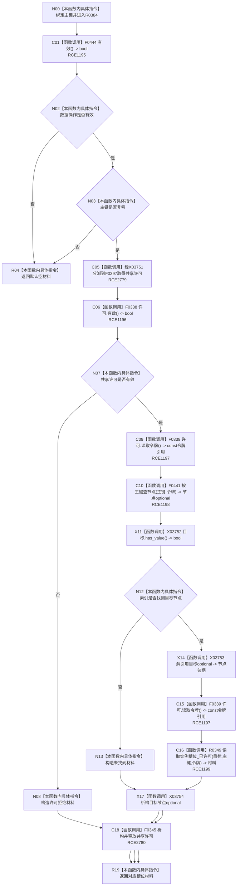

# CF-L10-0070 特征体系读取主键实例特征槽位现状流程图

图类型：现状流程图
代码版本：`3920a74638264f9f539d50f32f3c9fe5fb1982ab`
源码 blob：`a47cd9b07794d30abc6cb9d1df319056105cd596`
覆盖文件：`海中鱼巣/领域/数据操作.特征体系.ixx:593-600`
唯一根函数：R0384
完整签名：`特征槽位值式材料 海中鱼巣::特征体系数据操作::读取主键实例特征槽位(std::uint64_t 主键) const`
参数：`主键` 按值输入；非零且数据操作有效后取得运行期共享许可
返回结果：入口无效时返回默认空材料；许可拒绝时返回状态为 `许可拒绝` 的材料；主键未找到时返回状态为 `未找到` 的材料；找到目标时返回 R0349 的已许可读取结果
调用图：`流程图/主程序可达调用关系/01_main可达项目调用边表.md`
已登记调用方：R0389（RCE1230）
直接项目函数：F0444（RCE1195）、F0397（RCE2779）、F0338（RCE1196）、F0339（RCE1197）、F0441（RCE1198）、R0349（RCE1199）、F0345（RCE2780）
外部边界：X03751（共享许可函数指针分派）、X03752—X03754（节点句柄 optional）
未解析项目调用：0
逐行映射表：`流程图/代码流程图/L10/CF-L10-0070_特征体系读取主键实例特征槽位_逐行代码映射表.md`
依据提交 / 结构化消息：调用关系发布基线 `caab8644416dea13ea598b714289d1c86ac05304`；冻结源码提交 `3920a74638264f9f539d50f32f3c9fe5fb1982ab`
结构读取与写入：只读索引和已发布特征槽位结构；局部节点 optional 与共享许可按逆序释放
逻辑内返回：数据操作无效、主键为零、共享许可拒绝或索引未找到
内部错误边界：R0349 在前置通过后的结构异常口径由其独立现状图承载
不得作为施工许可：是
不得宣称：索引命中本身已经证明节点是完整、唯一且当前的实例特征槽位

## 流程图

## 当前边界

- RCE1195 只对应第 594 行本对象 `有效()`；原聚合误把第 596 行 `许可.有效()` 也列为 F0444，第 596 行实际由 RCE1196 绑定 F0338。
- 第 595 行函数指针在当前生产接线唯一解析到 F0397，同时保留 X03751 的函数指针分派边界；局部许可由 RCE2780 在全部许可后返回路径调用 F0345 释放。
- 索引 optional 的 `has_value()`、解引用与析构分别由 X03752、X03753、X03754 承载；未找到分支不执行解引用。
- R0349 的非平凡内部过程由 `流程图/代码流程图/L11/CF-L11-0063_特征体系读取实例槽位已许可_现状流程图.md` 独立承载。
