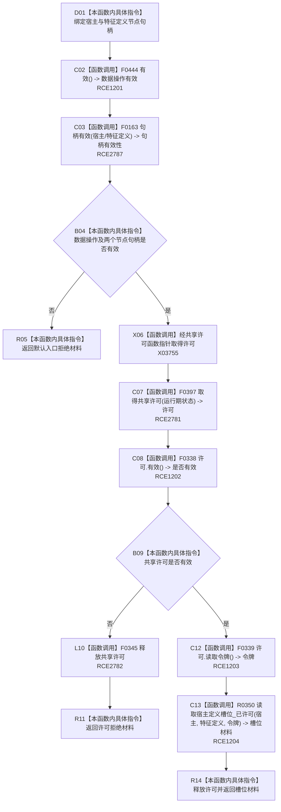

# CF-L10-0071 特征体系读取宿主定义槽位现状流程图

图类型：现状流程图
代码版本：`3920a74638264f9f539d50f32f3c9fe5fb1982ab`
源码 blob：`a47cd9b07794d30abc6cb9d1df319056105cd596`
覆盖文件：`海中鱼巣/领域/数据操作.特征体系.ixx:602-607`
唯一根函数：R0385
完整签名：`海中鱼巣::特征槽位值式材料 海中鱼巣::特征体系数据操作::读取宿主定义槽位(海中鱼巣::节点句柄 宿主, 海中鱼巣::节点句柄 特征定义) const`
参数：`宿主`、`特征定义` 均按值传入节点句柄；函数不延长其生命周期
返回结果：入口无效时返回默认入口拒绝材料；共享许可失败时返回许可拒绝材料；许可成立时返回 R0350 的完整读取结果
调用图：`流程图/主程序可达调用关系/01_main可达项目调用边表.md`
逐行映射表：`流程图/代码流程图/L10/CF-L10-0071_特征体系读取宿主定义槽位_逐行代码映射表.md`
输入契约 / 调用语境表：本图“输入与返回边界”
非成功返回二分审查表：配对逐行映射的“非成功口径”
偏差清单：RCE1200 对节点句柄误绑关系句柄重载，改由 RCE2787；补 RCE2781、RCE2782 与 X03755
依据提交 / 结构化消息：聚合关系基线 `caab8644416dea13ea598b714289d1c86ac05304`；冻结源码提交 `3920a74638264f9f539d50f32f3c9fe5fb1982ab`
验证输出：本批 Mermaid、节点双向、源码覆盖与差异格式检查
不得作为施工许可：是
不得宣称：取得共享许可或返回值式材料表示槽位结构已经新建或发布

## 流程图

## 输入与返回边界

- RCE2787 的两个调用点都绑定 `节点句柄` 重载 F0163；旧 RCE1200 指向 `关系句柄` 重载 F0168，不符合实参静态类型。
- X03755 表达接线函数指针调度，RCE2781 表达其已解析项目目标 F0397；二者分账记录同一调用点的边界形态与项目落点。
- 许可对象在有效与无效分支都按 RAII 调用 F0345；R0350 只在许可有效且令牌可读时执行。
