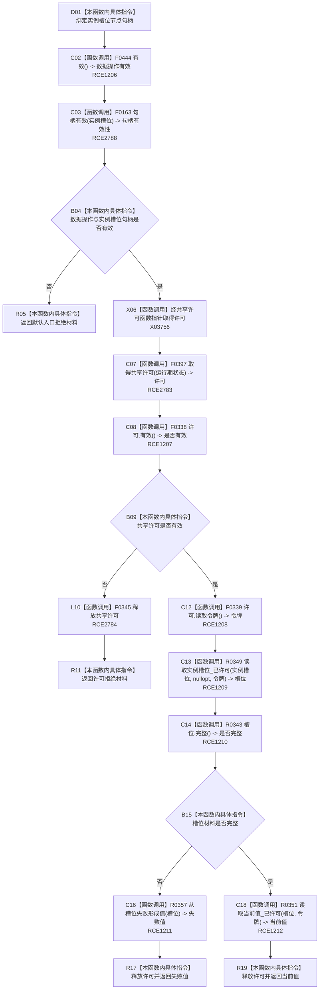

# CF-L10-0072 特征体系读取实例槽位当前值现状流程图

图类型：现状流程图
代码版本：`3920a74638264f9f539d50f32f3c9fe5fb1982ab`
源码 blob：`a47cd9b07794d30abc6cb9d1df319056105cd596`
覆盖文件：`海中鱼巣/领域/数据操作.特征体系.ixx:609-616`
唯一根函数：R0386
完整签名：`海中鱼巣::特征原始值式材料 海中鱼巣::特征体系数据操作::读取实例槽位当前值(海中鱼巣::节点句柄 实例槽位) const`
参数：`实例槽位` 按值传入节点句柄；函数不延长其生命周期
返回结果：入口无效返回默认材料；许可失败返回许可拒绝；槽位读取不完整时映射槽位失败；否则返回 R0351 的当前值材料
调用图：`流程图/主程序可达调用关系/01_main可达项目调用边表.md`
逐行映射表：`流程图/代码流程图/L10/CF-L10-0072_特征体系读取实例槽位当前值_逐行代码映射表.md`
输入契约 / 调用语境表：本图“输入与返回边界”
非成功返回二分审查表：配对逐行映射的“非成功口径”
偏差清单：RCE1205 对节点句柄误绑关系句柄重载，改由 RCE2788；补 RCE2783、RCE2784 与 X03756
依据提交 / 结构化消息：聚合关系基线 `caab8644416dea13ea598b714289d1c86ac05304`；冻结源码提交 `3920a74638264f9f539d50f32f3c9fe5fb1982ab`
验证输出：本批 Mermaid、节点双向、源码覆盖与差异格式检查
不得作为施工许可：是
不得宣称：读取到当前值材料表示形成了新的当前值或发布代次

## 流程图

## 输入与返回边界

- RCE2788 精确绑定 `节点句柄` 重载 F0163；旧 RCE1205 指向 `关系句柄` 重载 F0168，必须停用。
- X03756 表达函数指针边界，RCE2783 表达已解析项目目标；F0345 在许可构造后的所有返回路径释放 RAII 许可。
- 槽位不完整时不继续读取当前值，由 R0357 保留原槽位读取状态并形成相应值式结果。
